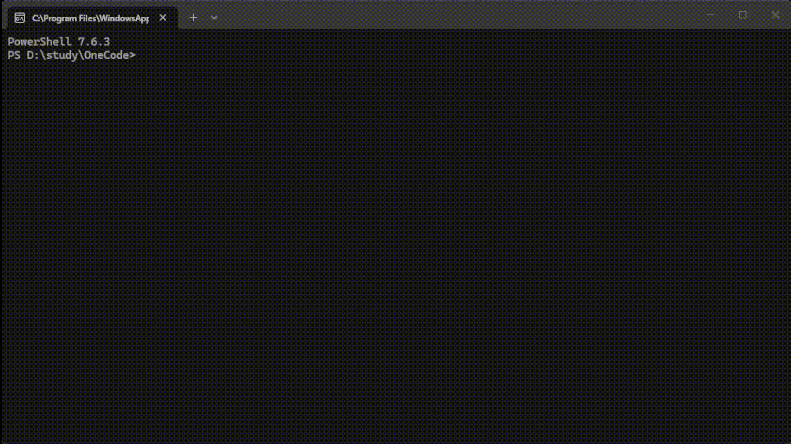

# OneCode

中文 | [English](README_en.md)

 
<p align="center">
  
</p>



OneCode 是一个基于 **Harness** 工程理念实现的 **CodeAgent**。它把大模型当作具有工具调用能力的执行者，用一个稳定可控的工程框架去约束它、组织它、并承接它的副作用，从而让 AI 能够在真实环境中可靠地完成长链路编码任务，而不会失控越界。

[项目介绍Slide](docs/assets/onecode-intro.html) (该演示由 OneCode 使用 `frontend-slides` skill 生成)。

---

## 核心功能

### 主循环 
OneCode 围绕一个薄而稳定的主循环展开，驱动 agent 的"思考—行动—观察"流程。主循环只负责编排 agent 的生命周期：确定性的状态转换负责处理错误恢复、预算控制和会话结束，而不会让 agent 的能力扩张污染这一层的逻辑。

### 通过 Hooks 机制实现扩展 
所有的非核心能力都通过 **钩子(Hook)** 接入：开发者可以在主循环的关键节点注入确定性的工程约束、安全规则和业务逻辑，把那些仅靠模型 prompt 无法保证的行为兜底为代码。Hooks 与主循环解耦，新增能力不需要修改主循环本身。

### 上下文工程 
OneCode 把每轮送入模型的上下文视为一项工程产物：消息链、transcript、快照在每轮都会被运行时状态动态重建；多级压缩、长期记忆、`@mention` 附件投影以及动态 system prompt 协同工作，确保模型始终看到高信息密度的内容，而不是越积越多的历史消息。

### 可扩展的工具体系 
所有的内置能力和外部扩展都通过统一的 **工具注册表** 接入：注册表定义工具的执行逻辑、权限边界和错误反馈契约，工具在受控环境中执行，任何异常都会被捕获并转化为上下文反馈。内置工具覆盖文件、命令、检索、附件、后台任务、子 agent 等场景；外部能力通过 **Skill** 和 **MCP** 以同样的方式注册进来。

### 可中断、可恢复的状态 
运行时的对话记录和工具调用历史被独立持久化：长任务中断后可以从断点继续执行，所有运行记录都保留为可重放的轨迹，而不是只留在内存里。

### 观测与分析 
系统把运行时的 **trace** 和 **error log** 结构化记录下来：每一次决策、每一次工具调用、每一次状态转换都有据可查，方便后续调试、回放与评估。

### 能力集成 
复杂任务可以拆解给 **Subagent**、长耗时的操作可以放到 **后台任务 (Background Task)** 中、领域知识可以封装为可加载的 **Skill**、外部工具则通过 **MCP** 接入。所有这些都以模块形式接入主循环，不会让核心层为某一项功能膨胀。

### 多模型 Provider 适配 
模型提供方被隔离在基础设施层：业务逻辑只依赖 provider-neutral 协议，可以方便地在不同模型厂商之间切换，而无需修改 agent 的运行逻辑。

### 分层安全与权限
文件路径沙箱、权限决策和生命周期钩子分层协作：危险操作在到达执行层之前就被拦截，系统的安全边界不依赖模型的"自觉"。

---

## 快速开始

OneCode 需要 **Python 3.11 或以上版本**，并使用 [uv](https://docs.astral.sh/uv/) 管理依赖。

### 1. 准备环境

```bash
# 同步虚拟环境（含开发依赖）
uv sync --dev

# 复制环境变量模板
cp .env.example .env
```

OneCode 的模型 Provider 配置从 `.env` 读取。如果暂时不想配置，可以直接启动终端，在终端内使用 `/connect` 命令配置。

### 2. 启动终端

```bash
# Windows 请先激活虚拟环境
.\.venv\Scripts\Activate.ps1

# 启动内联终端 REPL
uv run python -m ui.cli.app
```

也支持 Batch 模式：当标准输入不是 TTY 时自动进入批处理，例如：

```bash
echo "帮我列出当前目录的文件" | uv run python -m ui.cli.app
```

---

## 开发指南

OneCode 是一个典型的 harness-style 工程：项目的目标架构、知识地图、工作约定都以文档形式显式维护，再由 AI agent及开发者按文档执行。这种模式下，文档本身就是接口，遵循文档比遵循 prompt 更重要。

- **理解项目 — 阅读 [`AGENTS.md`](AGENTS.md)**：`AGENTS.md` 是 agent 进入本仓库的入口文件。它说明项目知识的存放位置、推荐的阅读顺序、依赖边界约束、环境准备方式以及常用命令。当你（或一个 AI agent）第一次接触这个仓库，应当从 `AGENTS.md` 开始，再按它指明的顺序阅读 `architecture.md` 和 `docs/design-docs/`。
- **阅读设计 — 查看 [`architecture.md`](architecture.md)**：根架构文档定义目标运行时结构、逻辑分层、核心抽象和依赖方向；模块级的设计细节请按需进入 `docs/design-docs/` 下的对应文档。
- **制定计划 — 使用 [`PLANS.md`](PLANS.md)**：对于复杂功能或重大重构，应当按照 `PLANS.md` 中的格式撰写一份 ExecPlan（执行计划），从设计一路写到实现细节。计划在 `docs/exec-plans/active/` 中维护，完成后归档到 `docs/exec-plans/completed/`。
- **记录债务 — 使用 [`tech_debt_tracker_guide.md`](tech_debt_tracker_guide.md)**：项目使用技术债务跟踪器记录已知捷径和风险，新增或变更债务条目时请遵循该指南。
- **运行测试 / 边界校验**：
  ```bash
  uv run python -m pytest tests -q                    # 完整测试套件
  uv run python -m pytest tests/test_import_boundaries.py -q   # 依赖边界校验
  uv run python -m compileall core services infrastructure      # 编译检查
  ```

---

## 模块文档索引

想深入了解 OneCode 各模块的设计与实现，请查阅以下文档：

**核心编排**
- [`core-runtime-architecture.md`](docs/design-docs/core-runtime-architecture.md) — `core/` 编排层

**上下文管理**
- [`context-architecture.md`](docs/design-docs/context-architecture.md) — 消息链 / transcript / 快照
- [`compaction-architecture.md`](docs/design-docs/compaction-architecture.md) — 压缩与 session memory
- [`prompt-architecture.md`](docs/design-docs/prompt-architecture.md) — 动态 system prompt

**钩子系统**
- [`hook-architecture.md`](docs/design-docs/hook-architecture.md) — 循环扩展点

**记忆系统**
- [`memory-architecture.md`](docs/design-docs/memory-architecture.md) — 长期记忆与指令记忆

**附件系统**
- [`attachment-architecture.md`](docs/design-docs/attachment-architecture.md) — `@mention` 与附件投影

**工具系统**
- [`tool-runtime-architecture.md`](docs/design-docs/tool-runtime-architecture.md) — 工具运行时
- [`builtin-tools-architecture.md`](docs/design-docs/builtin-tools-architecture.md) — 内置工具职责

**安全与权限**
- [`guard-architecture.md`](docs/design-docs/guard-architecture.md) — 沙箱与路径安全
- [`permission-architecture.md`](docs/design-docs/permission-architecture.md) — 权限决策

**能力集成**
- [`subagent-architecture.md`](docs/design-docs/subagent-architecture.md) — 子 agent
- [`skill-architecture.md`](docs/design-docs/skill-architecture.md) — skill 系统
- [`mcp-architecture.md`](docs/design-docs/mcp-architecture.md) — MCP 集成
- [`task-architecture.md`](docs/design-docs/task-architecture.md) — 任务系统
- [`background-task-architecture.md`](docs/design-docs/background-task-architecture.md) — 后台任务

**边界与界面**
- [`model-provider-architecture.md`](docs/design-docs/model-provider-architecture.md) — 模型与 provider
- [`observability-architecture.md`](docs/design-docs/observability-architecture.md) — trace 与 error log
- [`cli-architecture.md`](docs/design-docs/cli-architecture.md) — CLI 界面

**横切约定**
- [`core-beliefs.md`](docs/design-docs/core-beliefs.md) — 设计信念与反模式
- [`tool-design-guidelines.md`](docs/design-docs/tool-design-guidelines.md) — 新增工具设计指南

---

## 许可证

MIT