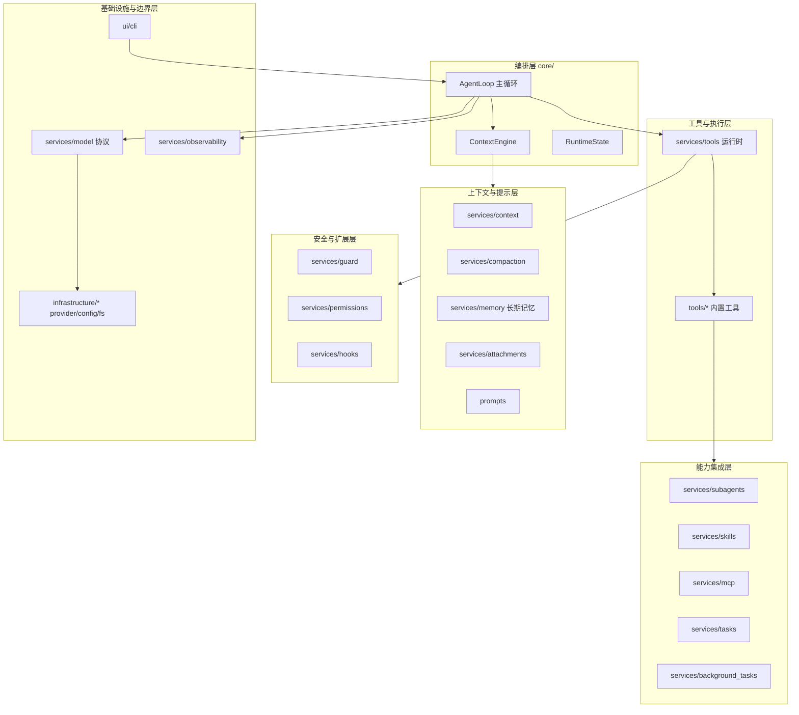
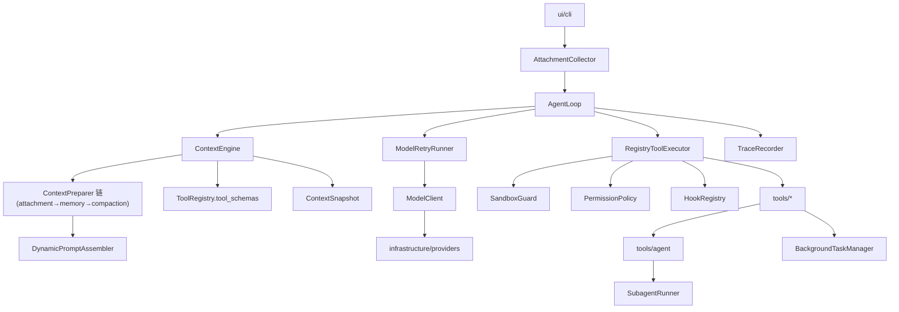

# OneCode 架构

本文是 OneCode 的根架构说明，只保留系统级架构总览、逻辑分层、核心抽象、依赖方向和运行流程。各模块的文件职责、接口设计、数据流图、关键机制和当前边界放在 `docs/design-docs/` 的模块架构文档中。

## 项目定位

OneCode 是一个 Python code agent runtime。它的核心不是 CLI wrapper，而是围绕 agent 主循环、上下文治理、工具执行、安全边界、动态 prompt、模型适配、记忆系统、子 agent、后台任务、会话记录和可观测性组成的可演化运行时。

架构目标：

- 主循环保持薄，只负责编排 agent 生命周期。
- 上下文、prompt、工具 schema 每轮由运行时状态动态重建。
- 工具通过 registry、descriptor、classifier 和 executor 接入，不在主循环硬编码工具名。
- 路径边界、权限判断和 hook 扩展分层处理，deny 结果不能被 hook、用户确认或 session allow 覆盖。
- 模型 provider 隔离在 infrastructure 中，core 只依赖 provider-neutral 协议。
- 上下文压缩、session memory、long-term memory、附件、subagent、skill、MCP、task 和后台任务都作为可注册、可治理的层接入，而不是塞进主循环。
- CLI 是 UI 的一种实现，不直接承载 agent runtime 逻辑。
- transcript、trace、error log 是上下文治理、恢复和可观测性的基础设施。

更深层的设计信念见 `docs/design-docs/core-beliefs.md`。

## 逻辑分层

OneCode 在逻辑上分为六层。每一层只依赖更下层的 provider-neutral 契约，不反向依赖编排层。



## 逻辑模块划分与职责

| 层 | 模块 | 核心职责 | 模块文档 |
|:---|:---|:---|:---|
| 编排 | `core/` | agent 生命周期主循环、每轮上下文重建边界、会话级运行状态、transition、对外 stream event | `core-runtime-architecture.md` |
| 上下文 | `services/context/` | 内存消息链、JSONL transcript、模型快照、消息滑窗投影 | `context-architecture.md` |
| 上下文 | `services/compaction/` | tool result 预算、micro/auto/manual/reactive 压缩、session memory | `compaction-architecture.md` |
| 上下文 | `services/memory/` | 跨会话长期记忆、指令记忆（ONECODE.md）、相关记忆注入、记忆提取 | `memory-architecture.md` |
| 上下文 | `services/attachments/` | @mention 收集、durable attachment role、provider 可见投影 | `attachment-architecture.md` |
| 提示 | `prompts/` | 动态 system prompt 组装、可组合 section、section 缓存 | `prompt-architecture.md` |
| 工具 | `services/tools/` | descriptor、registry、schema 投影、executor 执行管线、并发、结果预算 | `tool-runtime-architecture.md` |
| 工具 | `tools/` | read_file、edit_file、write_file、glob、grep、bash、agent、skill、task、background 等具体工具 | `builtin-tools-architecture.md` |
| 安全 | `services/guard/` | 沙箱边界、路径分类、确定性 guard 决策 | `guard-architecture.md` |
| 安全 | `services/permissions/` | deny-first 权限合并、session/project 规则、用户确认 | `permission-architecture.md` |
| 安全 | `services/hooks/` | 生命周期扩展点、阻断/改写/审计 | `hook-architecture.md` |
| 集成 | `services/subagents/` | 内置 agent、fork、child runtime 装配 | `subagent-architecture.md` |
| 集成 | `services/skills/` | skill 发现、catalog、inline/fork 加载 | `skill-architecture.md` |
| 集成 | `services/mcp/` | MCP server 连接、工具发现、动态 descriptor | `mcp-architecture.md` |
| 集成 | `services/tasks/` | 文件持久化任务、依赖图、claim | `task-architecture.md` |
| 集成 | `services/background_tasks/` | 后台 bash/agent/dream 生命周期、通知 | `background-task-architecture.md` |
| 边界 | `services/model/` + `infrastructure/` | provider-neutral 模型协议、重试、provider 适配、配置、跨平台路径 | `model-provider-architecture.md` |
| 边界 | `services/observability/` | 结构化 trace、error log、脱敏 | `observability-architecture.md` |
| 边界 | `ui/cli/` | 运行时装配、交互、slash 命令、渲染、权限提示 | `cli-architecture.md` |

横切约定文档：`core-beliefs.md`（设计信念）、`tool-design-guidelines.md`（新增工具约定）。

## 当前代码模块地图

```text
OneCode/
  core/                      # 编排层
    loop.py context_engine.py runtime_state.py transitions.py stream_events.py

  prompts/                   # 动态 system prompt
    assembler.py sections.py runtime_context.py cache.py

  services/
    context/                 # 消息链、transcript、快照、投影
    compaction/              # 压缩、session memory、result store
    memory/                  # 长期记忆、指令记忆
    attachments/             # 附件收集与投影
    tools/                   # 工具运行时
    guard/                   # 沙箱与路径安全
    permissions/             # 权限决策
    hooks/                   # 生命周期扩展
    subagents/               # 子 agent
    skills/                  # 技能
    mcp/                     # MCP 集成
    tasks/                   # 任务系统
    background_tasks/        # 后台任务
    model/                   # 模型协议与重试
    observability/           # trace 与 error log
    errors.py                # provider-neutral 错误分类

  utils/                     # 跨 service 共享的小型基础设施
    toolResultStorage/       # 工具结果 artifact 命名、去重、持久化和引用文本

  tools/                     # 内置工具
    read_file/ edit_file/ write_file/ glob/ grep/ bash/
    agent/ skill/
    task_create/ task_get/ task_list/ task_update/
    background_task_stop/

  infrastructure/            # 可替换边界
    config/ filesystem/ providers/

  ui/
    cli/                     # 标准库 CLI
```

## 核心抽象

`AgentLoop`（`core/loop.py`）是薄主循环。它接收用户输入（`stream`）或从已 seed 的消息链继续（`continue_stream`），每轮调用 `ContextEngine` 构建 `ContextSnapshot`，经 `ModelRetryRunner` 调用 `ModelClient` 消费 provider-neutral stream event，按需调用 `ToolExecutor`，并把 assistant message 与 tool result 写回 `MessageStore`。它只依据实际 tool calls 决定是否续轮，不依赖 provider 私有 `stop_reason`。

`RuntimeState`（`core/runtime_state.py`）保存单会话运行状态：usage、turn count、max turns、恢复标志、session id、last transition 和 metadata。metadata 承载运行期事实，例如 `files_read`、`files_changed`、`disabled_tools`/`denied_tools`/`hidden_tools`、`read_only_agent`、`is_fork_child`、`model_request_overrides`、`task_list_id` 等。

`ContextEngine`（`core/context_engine.py`）是每轮模型调用前的上下文重建边界。它读取 `MessageStore`，经可注入的 `ContextPreparer`（CLI 中是 attachment → 相关记忆 → compaction 的洋葱链），再调用 `PromptAssembler` 和 `ToolSchemaProvider`，返回 `ContextSnapshot`。

`ContextSnapshot`（`services/context/snapshot.py`）是 provider 调用前的模型可见快照，包含 system prompt、messages、tool schemas、usage hints、transcript refs 和当前 transition。

`MessageStore` 是内存优先的 session message store，并通过 `JsonlTranscriptStore` 写入 `.onecode/<session_id>/messages.jsonl`。内部使用 `role` 取值 `user`/`assistant`/`tool_result`/`attachment`；provider adapter 负责把 `tool_result` 投影成 wire format，`attachment` 由 context preparer 在调用前投影后隐藏。

`ModelClient`（`services/model/client.py`）是 provider-neutral 模型协议，通过 `stream(snapshot)` 产出 `ModelStreamEvent`。`ModelRetryRunner` 在其上做缓冲式重试，只依据 `ProviderError.retryable` 与 `error_type` 决策。

`ToolDescriptor`（`services/tools/types.py`）是工具事实来源，定义名称、描述、输入/输出 schema、prompt、search hint、`validate_input`、input-aware `classify_input` 和 handler。`ToolCallClassification` 描述单次调用的只读性、文件系统修改、并发安全、`ToolTarget` 集合、结果预算和权限 subject。

`ToolRegistry` 从同一个可见工具视图同时生成 provider tool schema 和 prompt 工具说明。被 disabled、denied 或 permission policy 隐藏的工具不会进入模型可见能力。`RegistryToolExecutor` 是统一执行入口，按 descriptor 查找、校验、分类、执行 guard 与 permission policy、运行 hook、调用 handler、应用结果预算、维护 executor 自有 side effect，并输出统一 `ToolExecutionResult`。

`SandboxGuard` 与 `PermissionPolicy` 共同构成执行前安全边界：guard 做确定性路径分类，permission policy 做 deny-first 决策合并。`HookRegistry` 是生命周期扩展点，hook 不能绕过 guard deny。`TraceRecorder` 与 `ErrorLogRecorder` 是结构化可观测性入口。

## 运行流程



当前每轮执行顺序：

1. CLI 收集 `@mention`、共享源和文件变更附件，把用户输入交给 `AgentLoop.stream(prompt, attachments)`；子 agent 用 `continue_stream()` 从已 seed 的链继续。
2. loop 触发 `UserPromptSubmit` hook，把用户消息和 durable attachment 追加到 `MessageStore`，发布 interaction 事件。
3. loop 递增 turn count；超过 `max_turns` 时设置 `max_turns` transition 并停止。
4. `ContextEngine` 重建 `ContextSnapshot`：读取消息 → context preparer 链（附件投影、相关记忆注入、压缩）→ 组装 system prompt → 获取当前可见工具 schema。
5. loop 经 `ModelRetryRunner` 调用 `ModelClient.stream(snapshot)`；retryable provider error 触发 `rate_limit_retry` 与指数退避，失败 attempt 的 partial 事件不外显。
6. provider adapter 归一化完整 assistant message、final text、tool calls、usage 和 stop reason。
7. 若 `context_limit_exceeded` 且首次，触发 reactive compact 并 `reactive_compact_retry`；若输出被截断，触发 max-output escalate / recovery。
8. loop 累计 usage、写入 assistant message，触发 `AssistantMessageCompleted` hook（可触发 session memory 提取）。
9. 若存在实际 tool calls，交给 `RegistryToolExecutor`（preflight → guard → permission → hook → handler → 结果预算 → side effect → trace），把结果与 followup 写回，设置 `tool_use` transition，进入下一轮。
10. 若没有 tool calls，触发 `TurnStopped` hook（CLI 据此启动 long-term memory dream 后台任务），设置 `completed` transition，返回最终文本。

## 依赖方向

```text
ui / application composition -> core
core -> services 契约 (context/model/tools/hooks/observability) + prompts 协议
context preparer 链 -> services.context / compaction / memory / attachments
tools -> services.tools 类型 / ToolRuntime
services.tools -> services.guard / permissions / hooks
infrastructure.providers -> services.model / context / tools 类型
services.guard -> infrastructure.filesystem
services.* -> services.errors (仅 stdlib)
```

约束：

- `core/loop.py` 不能 import 具体工具目录，也不能 import 具体 provider。
- `services/tools/` 不能静态 import 顶层 `tools/<tool_name>/`。
- `tools/` 可依赖 `services.tools` 公共类型和 `ToolRuntime`，但不能依赖 `core/loop.py`。
- `infrastructure/` 不能依赖 `core/`。
- `prompts/` 可读取工具 descriptor 的 prompt 文本，但不能执行工具。
- `services/guard/` 的 deny 结果不能被 hook、session allow、permission prompter 或模型请求覆盖。

## 主循环边界

主循环只表达 agent 生命周期编排：

```text
receive prompt
append user message (+ attachments)
while running:
  increment turn count
  stop if max_turns exceeded
  build ContextSnapshot
  call model stream (with retry)
  on context_limit -> reactive compact -> continue
  on output_interrupted -> escalate / recovery -> continue
  append assistant message
  if actual tool calls:
    execute tools
    append tool results (+ followup)
    set tool_use transition
    continue
  set completed transition
  return final answer
```

以下逻辑不进入主循环：具体工具名判断、provider wire 字段、路径解析与 sandbox 规则、prompt section 文本、权限 UI、压缩与记忆策略细节、trace 文件格式、CLI slash command 与渲染。

## 安全与上下文治理原则

OneCode 的安全边界由代码路径保证，不依赖模型自觉。路径解析、guard、permission policy、工具级输入校验和 handler 兜底检查共同组成执行前安全链路。deny 是最高优先级：任何有效 deny 都同时影响模型可见能力和执行入口；hook、用户确认、session allow 和历史消息中的旧工具调用都不能覆盖 deny。hook 是扩展点，不是安全边界替代品；hook 更新输入后必须重新经过 schema validation、工具 validation、classification、guard 和 permission policy。

上下文是 agent 的受管理工作内存，不是无限聊天记录。当前已实现内存消息链、JSONL transcript、大结果外置、tool result 预算、micro/auto/manual/reactive 压缩、session memory、long-term memory 和附件投影；这些治理能力由 `ContextEngine` 与 context preparer 链编排，并通过 `ContextSnapshot` 交给 provider，不进入 `AgentLoop` 的具体分支。

## 模块文档索引

编排与上下文：

- `docs/design-docs/core-runtime-architecture.md`
- `docs/design-docs/context-architecture.md`
- `docs/design-docs/compaction-architecture.md`
- `docs/design-docs/memory-architecture.md`
- `docs/design-docs/attachment-architecture.md`
- `docs/design-docs/prompt-architecture.md`

工具与安全：

- `docs/design-docs/tool-runtime-architecture.md`
- `docs/design-docs/builtin-tools-architecture.md`
- `docs/design-docs/guard-architecture.md`
- `docs/design-docs/permission-architecture.md`
- `docs/design-docs/hook-architecture.md`

能力集成：

- `docs/design-docs/subagent-architecture.md`
- `docs/design-docs/skill-architecture.md`
- `docs/design-docs/mcp-architecture.md`
- `docs/design-docs/task-architecture.md`
- `docs/design-docs/background-task-architecture.md`

边界与界面：

- `docs/design-docs/model-provider-architecture.md`
- `docs/design-docs/observability-architecture.md`
- `docs/design-docs/cli-architecture.md`

横切约定：

- `docs/design-docs/core-beliefs.md`
- `docs/design-docs/tool-design-guidelines.md`

这些模块文档描述当前代码职责和局部架构。根文档优先用于判断跨模块归属、依赖方向和核心抽象。
