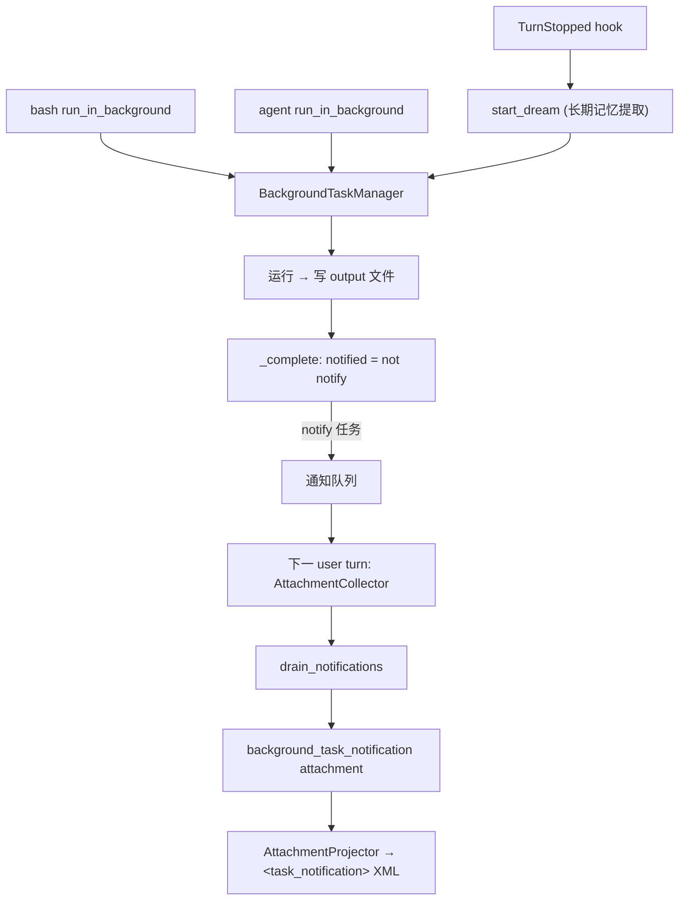

# Background Task Architecture

本文描述 `services/background_tasks/` 的架构：后台 bash、后台 agent 和长期记忆 dream 任务的生命周期管理，以及完成通知如何经 attachment 注入下一轮上下文。

## 文件职责

| 文件 | 职责 |
|:---|:---|
| `types.py` | `BackgroundTaskState`、`BackgroundTaskType`/`Status` |
| `ids.py` | 带类型前缀的随机 ID（`b_`/`a_`/`d_`） |
| `output.py` | 输出文件路径规则 |
| `manager.py` | `BackgroundTaskManager`：启动/停止/监控/通知队列 |
| `notifications.py` | `BackgroundTaskNotificationSource`：attachment 源适配 |

## 接口设计

### BackgroundTaskManager

```python
def start_bash(...) -> BackgroundTaskState        # subprocess.Popen + 监控线程
async def start_agent(...) -> BackgroundTaskState  # asyncio.create_task
def start_dream(...) -> BackgroundTaskState        # 长期记忆提取，不通知
async def stop(task_id) -> ...
def drain_notifications() -> tuple[dict, ...]
def list_tasks() -> ...
```

### 任务类型

| 类型 | 启动 | 执行 | 完成通知 |
|:---|:---|:---|:---:|
| `local_bash` | `start_bash` | `subprocess.Popen` + 监控线程 | 有 |
| `local_agent` | `start_agent` | `asyncio.create_task` 跑 async callback | 有 |
| `dream` | `start_dream` | 同上 | 无（`notify=False`，不进入 drain） |

## 核心数据流



## 关键机制

### 启动与停止

`_register` 生成类型前缀 ID（`b_`/`a_`/`d_` + 8 hex），创建并 touch 输出文件，初始 status `running`。`stop`：bash terminate → kill，agent/dream cancel asyncio task，写 `[background task stopped]`，status `killed`。`background_task_stop` 工具是模型可见的停止入口（见 `builtin-tools-architecture.md`）。

### 通知注入

`notify` 任务完成后进入通知队列；下一 user turn 时 `AttachmentCollector` 经 `BackgroundTaskNotificationSource.collect()` → `drain_notifications()` 产出 `background_task_notification` attachment（scope `SHARED`），由 `AttachmentProjector` 投影为 `<task_notification>` XML user 消息（含 `task_id`/`task_type`/`output_file`/`status`/`summary`，见 `attachment-architecture.md`）。`dream` 任务不通知用户，仅写 output 文件（见 `memory-architecture.md`）。

### 后台 agent 权限

后台 agent child 不挂 `permission_prompter`，遇 ask 直接返回 `permission_ask_required`，避免阻塞（见 `subagent-architecture.md`、`permission-architecture.md`）。

### 可观测性

manager 发布 `background_task_started`、`background_task_completed` 事件（见 `observability-architecture.md`）。

## 持久化路径

- 输出文件：`{workspace}/.onecode/sessions/<session_id>/background-tasks/<task_id>.output`（`BackgroundTaskState.output_file` 存相对 workspace 路径）。

## 当前限制

后台任务状态仅存进程内存，不持久化；重启丢失，但 `.output` 文件留在磁盘。
