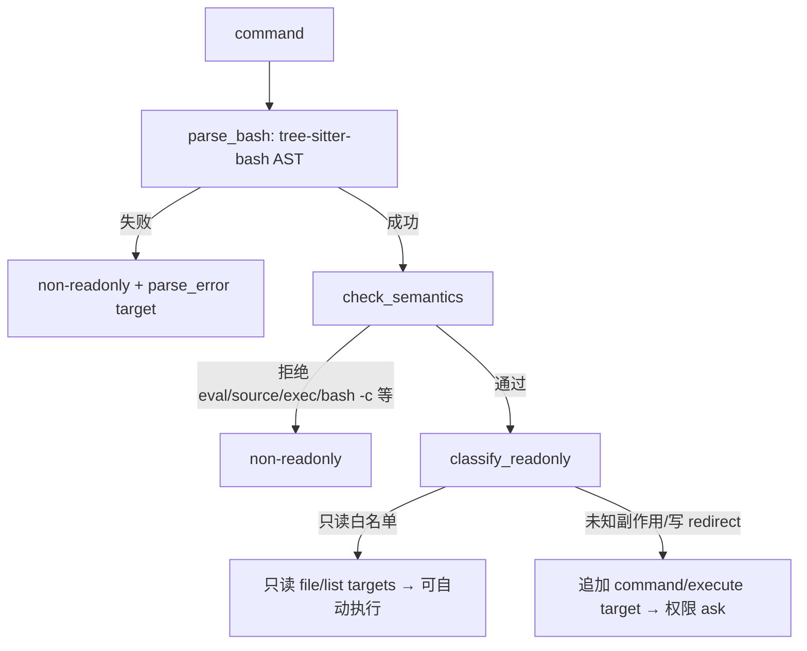

# Builtin Tools Architecture

本文描述顶层 `tools/` 下具体工具的职责。工具运行时能力（registry、executor、并发、结果预算）由 `services/tools/` 提供，见 `tool-runtime-architecture.md`；新增工具约定见 `tool-design-guidelines.md`。

## 工具目录约定

```text
tools/<tool_name>/
  __init__.py
  tool.py     # 导出 descriptor()，提供 schema、validator、classifier、handler
  prompt.py   # 导出模型可见的工具使用说明，经 ToolDescriptor.prompt 进入 assembler
```

工具可依赖 `services.tools` 公共类型和 `ToolRuntime`，但不能依赖 `core/loop.py`。路径类工具必须通过 `ToolRuntime.guard` 或 `services/guard/` 做兜底检查。

## 工具清单与分类

| 工具 | 关键输入 | read_only | modifies_fs | concurrency_safe | 主要 target | result_policy |
|:---|:---|:---:|:---:|:---:|:---|:---|
| `read_file` | `file_path`、`offset`、`limit` | 是 | 否 | 是 | `file/read` | 无限制、不持久化 |
| `edit_file` | `file_path`、`old_string`、`new_string`、`replace_all` | 否 | 是 | 否 | `file/write` | 50k、持久化 |
| `write_file` | `file_path`、`content` | 否 | 是 | 否 | `file/write` | 同上 |
| `glob` | `pattern`、`path`、`head_limit`、`offset` | 是 | 否 | 是 | `directory/list` | 100k、不持久化 |
| `grep` | `pattern`、`path`、`glob`、`output_mode`、上下文/大小写/分页 | 是 | 否 | 是 | `directory/read` | 20k、持久化 |
| `bash` | `command`、`timeout_ms`、`description`、`run_in_background` | 视命令 | 视命令 | 只读命令为是 | `command/execute` 或派生文件 target | 30k、不持久化 |
| `agent` | `prompt`、`subagent_type`、`run_in_background` | 是 | 否 | 否 | `session_state/mutate_state` | 默认 50k |
| `skill` | `skill`、`args` | 否 | 否 | 否 | `session_state/skill_load` | 100k、不持久化 |
| `task_create` | `subject`、`description`、`activeForm`、`metadata` | 否 | 否 | 是 | `session_state/task_write` | 默认 |
| `task_get` | `taskId` | 是 | 否 | 是 | `session_state/task_read` | 默认 |
| `task_list` | （无字段） | 是 | 否 | 是 | `session_state/task_read` | 默认 |
| `task_update` | `taskId`、`status`、`owner`、`addBlocks`、`addBlockedBy`、... | 否 | 否 | 是 | `session_state/task_write` | 默认 |
| `background_task_stop` | `task_id` | 否 | 否 | 否 | `session_state/background_task_stop` | 默认 |

MCP 工具在运行时动态生成（非 `tools/` 目录），见 `mcp-architecture.md`。

## 文件读写工具

`read_file` 读取 sandbox 内 UTF-8 文本文件，返回带行号内容，通过 `offset`/`limit` 自限流（故结果策略无限制且不持久化）。handler 内做二次 guard；执行成功后 executor 记录规范化路径到 `files_read`。

`edit_file` 对文本文件做 exact string replacement。约束：`old_string != new_string`；编辑已有文件前要求目标已在本 session 中被读取（`files_read`）；`old_string==""` 且目标不存在时可创建新文件；多重匹配未设 `replace_all` 返回 `multiple_matches` 错误；handler 内 `guard.check_write_target()` + `is_guard_policy_allowed`。

`write_file` 整文件写入。新建直接写；覆盖要求 `FileStateCache` 中存在完整读快照（非 partial），且若 mtime 变化且内容不同则返回 `file_unexpectedly_modified`。成功返回 unified diff（≤4000 字符）。

## 搜索工具

`glob` 用 `root.rglob("*")` + fnmatch 发现文件，对每个命中文件做 read guard，按 mtime 降序分页。`grep` 调用外部 `rg` 搜索内容，排除 VCS 目录，对搜索根与结果做 guard 过滤，支持 `content`/`files_with_matches`/`count` 三种 output mode，ripgrep 失败转为结构化错误，20KB 预算超出时持久化。

## bash

`bash` 通过 Git Bash（`bash --noprofile --norc -lc`）执行命令，cwd 为 guard boundary，找不到 Git Bash 返回 `git_bash_not_found`。

安全模型分四级（`_build_plan`）：



- AST 阶段拒绝无法静态理解的结构（subshell、compound、for/while/if/case、function、command/process substitution、expansion、heredoc、含 `$`/反引号的参数、brace expansion 等），fail-closed 为 `too_complex`。
- 语义阶段剥离可静态分析的 wrapper（`time`/`nohup`/`timeout`/`nice`/`env`/`stdbuf`），拒绝 `eval`/`source`/`.`/`exec`/`trap`、`bash -c`、`jq system()` 等动态执行形态。
- 只读分类基于命令白名单（`pwd`/`ls`/`cat`/`grep`/`rg`/`jq`、`git` 只读子命令、`find` 禁 `-exec/-delete`、`sed` 禁 `-i`），写 redirect 视为非只读。

`run_in_background=True` 经 `BackgroundTaskManager.start_bash()` 启动后台任务（无 manager 返回 `background_tasks_not_enabled`），见 `background-task-architecture.md`。

## agent 与 skill

`agent` 把 subagent 作为普通工具暴露：前台 `await SubagentRunner.run(...)`，后台经 `BackgroundTaskManager.start_agent()`。省略 `subagent_type` 触发 fork，详见 `subagent-architecture.md`。

`skill` 加载技能：`context=="fork"` 走 `SkillForkRunner`，否则 inline 返回 `followup_messages`（skill attachment）并通过 `metadata.allowed_tools` 触发 executor 授权。详见 `skill-architecture.md`。

## 任务与后台工具

`task_create`/`task_get`/`task_list`/`task_update` 操作文件持久化的任务系统，task list 作用域由 `resolve_task_list_id(state)` 解析；`task_create` 触发 `TaskCreated` hook（阻断则回滚），`task_update` 在 completed 前触发 `TaskCompleted` hook。详见 `task-architecture.md`。`background_task_stop` 终止后台 bash/agent/dream 任务，详见 `background-task-architecture.md`。
