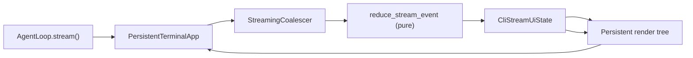
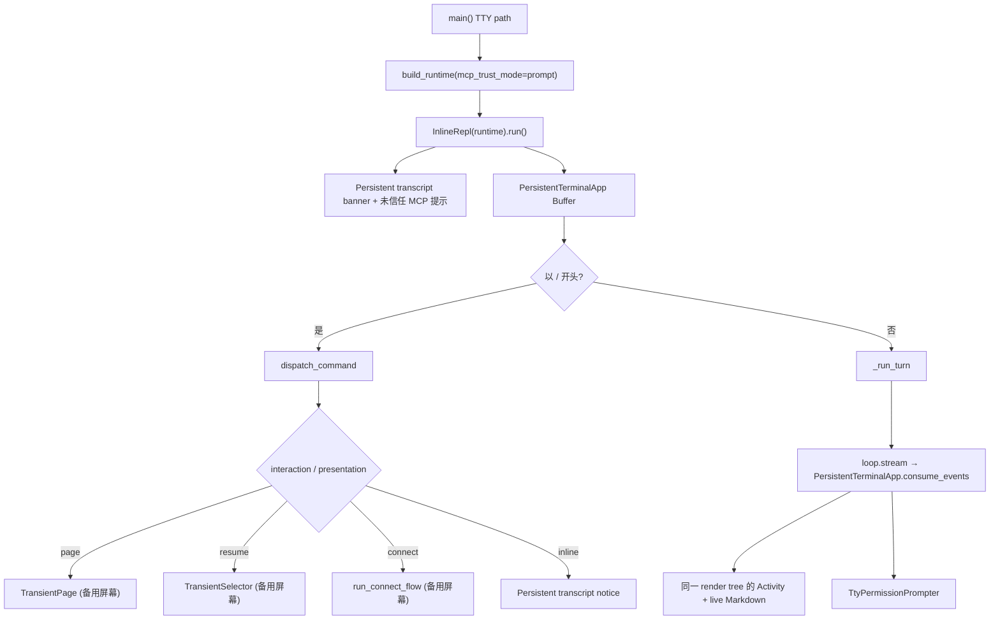

# CLI Architecture

本文描述 `ui/cli/` 的架构。CLI 是 Nervure 当前的增强 REPL 界面，负责应用装配、交互输入、命令处理、附件收集、权限提示和终端渲染，但不实现 agent 主循环、工具执行、安全策略或 provider 协议。

启动：`uv run python -m ui.cli.app`（TTY 时启动内联终端 REPL；stdin 非 TTY 时走 batch 路径）。

TTY 使用 `terminal.persistent_app.PersistentTerminalApp` 作为唯一渲染所有者：整个
交互生命周期只有一个 prompt_toolkit `Application`。用户消息、Activity、工具明细、
assistant 流式文本、HITL Interaction Pane 和输入框都在同一棵 render tree 中；agent event 只
更新 ViewModel，不直接写 stdout。Batch/non-TTY 仍走原有纯文本路径。

TTY 路径采用 **单一持久渲染树**（基于 `prompt_toolkit`）：transcript、Activity、流式预览、HITL Interaction Pane 和输入框始终由同一个 `Application` 绘制。内容是否可回看由 transcript ViewModel 决定，不通过第二个 streaming application 或 `run_in_terminal` 写静态 scrollback；`/status`、`/resume` 等临时界面仍可进入备用屏幕（DEC 1049）。

## 文件职责

| 文件 | 职责 |
|:---|:---|
| `app.py` | `build_runtime()` 依赖装配、`main()` 入口分流、MCP trust/skip 处理、长期记忆 dream 钩子 |
| `batch.py` | 非交互 batch：读 stdin 一行、`loop.stream()` 流式打印到 stdout |
| `input.py` | `read_batch_line()`、fallback `read_confirm_sync()`（MCP trust / batch 权限） |
| `terminal/` | 内联终端 REPL：`InlineRepl` 主循环、持久 render tree、备用屏幕查看页和临时确认界面（见下表） |
| `commands.py` | `CommandSpec` 注册表、slash command 解析与 `dispatch_command()` 分发 |
| `suggestions.py` | `/` 命令、`/resume` 参数、`@file` 内联补全数据 |
| `resume.py` | session summary 扫描、标题派生、transcript target 解析和恢复 helper |
| `connect.py` | `write_provider_env()`、provider 选项列举 |
| `theme.py` | Rich style 名称（前景色，永不设背景）、light/dark 主题选择、Unicode 状态符号 |
| `renderer.py` | Rich renderable 工厂、batch 路径 `print_renderable()` |
| `tool_renderers.py` | 工具结果 1 行摘要 |
| `views/` | 用户可见 Rich 状态视图 |
| `permissions.py` | 权限请求摘要格式化；不处理用户输入或构造 `PermissionResponse` |
| `types.py` | `CliRuntime`、`CommandResult` |

### `terminal/` 子模块

| 文件 | 职责 |
|:---|:---|
| `repl.py` | `InlineRepl` 主循环：装配、读输入、dispatch、`run_agent`、shutdown |
| `detect.py` | 终端背景明暗探测（OSC 11 → COLORFGBG → dark） |
| `static_output.py` | 静态区打印：反色用户行、`Nervure>` 前缀、工具横幅/结果、未信任 MCP 提示 |
| `prompt_session.py` | 兼容输入实现；persistent TTY 主路径由 `persistent_app.py` 的 Buffer 接管 |
| `completer.py` | `suggestions_for` → prompt_toolkit `Completer` 适配 |
| `queue.py` | 运行中输入队列（FIFO of `QueuedInput`，区分 prompt / slash） |
| `stream_session.py` | 兼容/测试用旧流式会话；persistent TTY 主路径直接在 `PersistentTerminalApp` 内消费 reducer 状态 |
| `persistent_app.py` | TTY 唯一 render owner：持久 transcript、Activity 折叠/鼠标 hit region、流式文本、HITL Interaction Pane 和输入框 |
| `stream_state.py` | turn 内 UI 状态模型 `CliStreamUiState`（streaming_text / tools / pending_static_commits / stream_mode） |
| `stream_reducer.py` | 纯函数 `reduce_stream_event`，事件 → state；无 I/O |
| `stream_view.py` | `render_stream_body_ansi` / `render_status_fragments` 把 state 翻译成 prompt_toolkit 可显示文本 |
| `output_coordinator.py` | 兼容旧流式会话和 batch 的提交协调器；persistent TTY turn 不调用它 |
| `transient.py` | DEC 1049 备用屏幕生命周期 + `can_enter_alternate_screen` 能力守卫 |
| `page.py` | 备用屏幕分页查看 renderable（`/status` 等），Esc 返回 |
| `selector.py` | 备用屏幕列表选择（`/resume`） |
| `connect_flow.py` | `/connect` 多步向导（备用屏幕） |
| `interaction_host.py` | TTY 临时交互 host，统一持有 Permission / AskUser / PlanReview 可擦除状态，并把自由文本复用到底部 Buffer |
| `permission_modal.py` | 权限请求 modal 状态、三选项构建和 ANSI 渲染 |
| `question_modal.py` | AskUser 选择题/自由文本题状态与 ANSI 渲染 |
| `plan_review_modal.py` | Plan Review 三选项、修改反馈阶段和 ANSI 渲染 |
| `permission_prompt.py` | `TtyPermissionPrompter` 薄封装，把权限请求委托给 interaction host |
| `trust_prompt.py` | MCP trust 启动期确认 |

## 入口分流

- **TTY**：`main()` 先构建 `CliRuntime`，使用 `mcp_trust_mode="prompt"` 在启动期询问未信任项目 stdio MCP server 的信任（通过 `trust_prompt` 回调），再运行 `InlineRepl(runtime).run()`。`InlineRepl` 打印 banner，提示被跳过的 MCP server，进入主循环。
- **非 TTY**：`batch.run_batch(workspace)`，不启动 prompt_toolkit；MCP trust 与权限 fallback 使用 stdin `read_confirm_sync()`。

## 内联布局（`terminal/`）

- **持久交互区**（`persistent_app.py`）：唯一的全屏 `prompt_toolkit.Application`。启动交互式 Nervure 后进入 alternate screen（DEC 1049），固定顶部 Header，中间维护可滚动 transcript / Activity / assistant 流式文本，底部保留 HITL Interaction Pane、输入分隔线和输入 Buffer；退出应用后返回原 PowerShell/terminal 屏幕。运行中的 turn 不写静态 scrollback，也不创建第二个 streaming application。
- **对话层级**：用户 turn 在 transcript 中渲染为独立 `You` 边框块，不再和 assistant/Activity 使用同一种普通文本行；assistant progress text 与 Activity 仍按 model turn 交错显示。
- **兼容静态输出**（`static_output.py` / `output_coordinator.py`）：只供 Batch、旧命令页面和兼容测试使用，不参与 persistent TTY turn 的渲染。
- **备用屏幕**（`transient.py` 等）：仍供主 persistent app 之外的启动期/兼容临时界面使用。persistent TTY 运行后 Permission / AskUser / PlanReview 都留在同一个 full-screen render tree 内，不嵌套第二个 alternate-screen Application。

## 接口设计

### build_runtime

```python
build_runtime(
    workspace,
    *,
    trust_prompt: Callable[[McpTrustPromptRequest], "trust"|"skip"] | None = None,
    permission_prompter: PermissionPrompter | None = None,
    mcp_trust_mode: Literal["prompt", "skip"] = "prompt",
) -> CliRuntime
```

`mcp_trust_mode="prompt"` 时，未信任项目 stdio MCP server 使用 `trust_prompt` 或 stdout + `read_confirm_sync()` 询问用户。内联 TTY 路径使用 `mcp_trust_mode="prompt"`（不再像旧路径那样默认 skip）。未信任 server 摘要写入 `RuntimeState.metadata["mcp_untrusted_servers"]`，随后由 `McpConnectionManager` fail closed 标记为 `untrusted`。batch 路径仍可显式传 `mcp_trust_mode="skip"`。

### 主对话流

`InlineRepl._run_turn()` 把 `runtime.loop.stream()` 事件交给持久的 `PersistentTerminalApp`。事件只经过 reducer 更新 ViewModel，再由唯一 render tree 重绘：

Activity 的 provider-neutral 控制字段位于 `ModelStreamEvent.metadata`：
`activity_id`（阶段身份）和 `activity_title`（用户可见标题）会随
`core.loop` 转发到 `tool_call_ready`。没有这些字段时，UI 只用工具类别作
低成本语义回退（分析/修改/测试/命令），`Working…` 仅保留为最终未知工具的安全兜底。



| 事件 | UI 行为 |
|:---|:---|
| `assistant_delta` | 累加到 `state.streaming_text` → 动态区 live Markdown 预览（50ms 节流，ANSI 渲染）。reducer 强制要求事件 metadata 携带稳定的 `assistant_call_id` 和 `model_turn_index`，缺失则进入 error 状态。 |
| `assistant_message_completed` | reducer 完成一段 assistant 文本；persistent app 将其保存在当前 turn transcript，继续由同一棵 render tree 显示。 |
| `tool_call_ready` / `tool_started` / `tool_progress` | reducer 维护 `state.tools`（queued / running），记录 `tool_call_id → assistant_call_id` 和 `tool_call_id → declared_index` 映射；view 在 body 显示 `tool: <name>` 列表；状态行显示 `tool: <name>` 或 `tools: N running`（**不会**显示裸 `thinking…`） |
| `tool_result` | reducer 更新对应 ActivityToolCall 的完成/错误状态；结果正文仍由普通 transcript/trace 路径持有，不灌入 Activity 明细。 |
| `completed` | reducer 翻 `turn_completed`；如果 `streaming_text` 仍有残留（例如 provider 没发 `assistant_message_completed`），兜底 commit 一次并清空。已完成 commit 不会重复打印。 |
| `error` | reducer 写入 `state.error_text`；active turn 在 body 尾部显示，turn 收尾时作为 notice 留在 persistent transcript。 |

turn 完成后 Activity 与 assistant 文本提交到 persistent transcript，应用继续保留输入框。Esc 只取消当前 submit task，不销毁 render owner；HITL modal 活跃时由 interaction host 优先消费取消键。

### Checkpoint 提交模型（execplan §M1/§M2/§M3/§M4）

旧的 `static_output.print_*` / `TerminalOutputCoordinator` 仍是兼容路径的输出边界，但 persistent TTY 不使用静态写入：reducer / view / `PersistentTerminalApp` 只修改并渲染 transcript ViewModel，唯一的 prompt_toolkit Application 负责屏幕更新。

- `queue_commit` / `flush_ready_checkpoints` 只服务旧 `StreamingSession` 和 batch 兼容测试，不是 persistent TTY 的提交边界。

每条 `StaticCommit` 携带稳定的 `assistant_call_id`（由 `core/stream_events.py::mint_assistant_call_id` 派生）和 `model_turn_index`，作为 assistant message → tool call → tool result 的 UI 归属回链。reducer 在 `tool_result` 时按**声明顺序**（`declared_index`）释放，不允许"后声明但先完成"的工具越过前面的工具。

权限确认不走 agent event 流，但也不由 prompter 自己打印确认文本。TTY 路径由 `terminal.interaction_host.TerminalInteractionHost` 统一持有 Permission / AskUser / PlanReview 临时 modal；`permission_prompt.TtyPermissionPrompter` 只把 `request_permission()` 委托给这个 host。持久 app 正在运行时，Interaction Pane 固定渲染在输入框上方；选择型交互由 `1/2/3`、`↑↓ + Enter` 或 `Esc` 驱动，自由文本 AskUser 和 Plan Review 修改意见则复用底部 Buffer 的 Enter。完成后 modal state 清空，Pane 消失且不污染 transcript。空闲状态下 host 启动一个 `full_screen=False, erase_when_done=True` 的临时 app，使用同一套 modal renderer 和 key bindings。

### Command Registry

`dispatch_command(runtime, line) -> CommandResult` 行为不变。`InlineRepl` 层处理：

- `presentation="page"` → `terminal.page.TransientPage`（备用屏幕，Esc 返回）
- `presentation="inline"` → 静态区 `Console.print`
- `replay_messages` 非空 → `terminal.transcript_replay.replay_messages_to_static`（恢复成功后在主 scrollback 中按正常静态输出函数重放历史）
- `interaction="resume_selector"` → `terminal.selector.TransientSelector` 选中后 `restore_runtime_from_target`，返回 inline 恢复通知 + `replay_messages`（不再展示恢复历史 page）
- `interaction="connect"` → `terminal.connect_flow.run_connect_flow` + `write_provider_env` + `with_model_config`
- `should_exit` → flush + 退出循环

`resume.py` 除 transcript 重放外，还读取 session-local `session_state.json`。workspace / Git HEAD / 已触及文件哈希不一致时返回 `WORKSPACE_DIVERGED` 并丢弃旧 `FileStateCache`；指令、工具/模型配置或权限模式不一致时返回 `STALE_CONTEXT`；全部匹配才是 `SAFE_RESUME`。`/undo` 仅选择当前 session 按 manifest 时间排序的最新有效 checkpoint，恢复前重新经过当前 sandbox guard，恢复后使对应文件缓存失效。

## 核心数据流



## 关键机制

### 终端主题

`detect.detect_terminal_brightness()` 探测宿主明暗（OSC 11 查询 → `COLORFGBG` → 暗色回退）。`theme.rich_theme_for(brightness)` 选择 light/dark Rich 主题；两份主题都只定义前景色，**永不设 background**，背景始终由终端提供。反色用户行在暗色用 `white on black`、亮色用 `black on white`。

### 补全与输入语义

`suggestions.py` 的 `suggestions_for(runtime, text, cursor)` 经 `completer.InlineCompleter` 接入 prompt_toolkit。菜单打开时：↑↓ 移动选中项；**Enter 采纳并提交**选中项（无选中则提交字面文本）；**Tab 仅将选中项填入输入框、不提交**。运行中输入框（`PersistentTerminalApp` 底部 Buffer）把 Enter 翻译成 `InputQueue.push`，因此 agent 输出期间继续输入不会被吞掉、也不会打断当前 turn。

**输入归口**：

- **空闲态提交** 归 `PersistentTerminalApp`：Buffer 的 Enter binding 创建 submit task。
- **运行中提交** 仍归同一个 `PersistentTerminalApp`：底部 Buffer 共享同一个 `InputQueue`；Enter 入队后清空 buffer。
- **队列 drain** 归 `InlineRepl._drain_queue`：当前 turn 结束后按 FIFO 弹出 `QueuedInput`，`kind == "slash"` 的走 `_handle_command`（不进 agent），`kind == "prompt"` 的走 `_run_turn`。
- 动态区 `view` 渲染 `queued_inputs` 快照，列出最多 N 条可见命令并折叠 overflow 摘要；这些行只在动态区显示，永远不写进静态 scrollback。

### Connect

启动时 `main()` 尝试 `build_runtime()`，若 `.env` 缺必要配置抛出 `ProviderError`，则改为 `build_unconfigured_runtime()` 创建精简 runtime（`configured=False`）。REPL 主循环在 `configured=False` 时拦截所有非 `/connect`、`/exit` 输入，提示用户使用 `/connect` 配置供应商。

`/connect` 由 `connect_flow.run_connect_flow` 多步向导完成（全程备用屏幕）：

1. **选择 Provider**：`TransientSelector` 列出 catalog 中所有供应商（含 Ollama 和 Custom）。
2. **Custom → 输入 Base URL**：`requires_base_url` 为 `True` 时先收集 URL。
3. **Key 处理**：检查 `.env` 中该 provider 是否已有 API key。
   - 有 → K/R/C 三选项（Keep 保留 / Replace 替换 / Cancel 取消）。
   - 无 + `api_key_required` → 输入新 key。
   - 无 + `not api_key_required`（Ollama）→ 跳过。
4. **拉取模型列表**：`fetch_models_for_connect` 自动探测端点。Ollama 用 `/api/tags`；其他 provider 优先试 `{base_url}/v1/models`，再试 `{base_url}/models`。失败时 fallback 到手动输入模型名 + `test_model_connection` 连接测试。
5. **模型选择器**：`TransientSelector` 展示模型列表。
6. **保存**：`write_provider_env()` 更新 `ONECODE_*` 键 → `with_model_config()` 重建模型客户端（`configured` 变为 `True`）。

启动时选定的 provider-visible 工具组合由 `runtime_tool_composition.RuntimeToolComposition` 保存：base descriptors 已包含 builtin 实验开关和 MCP descriptors，另保存词法 `ToolDiscovery` 与 `agent` 是否启用。`build_runtime()` 和 `with_model_config()` 都通过这个组合值构造 registry；后者只用新 model client 重建 runner-bound `agent` descriptor，不重新解释环境开关。因此 `/connect` 不会改变 disabled builtin、repo_map/symbol_search、MCP、PermissionPolicy 或 discovery 行为。

### 权限

TTY：`TerminalInteractionHost` 使用可擦除临时 permission modal，只消费 `PermissionRequest.options` 中的 allow once、allow session、deny 三项。Esc 和 Ctrl-C 返回 deny。流式预览运行中不启动嵌套 app、不打印 confirm，而是把 modal 渲染到当前动态区。非 TTY / batch：`BatchPermissionPrompter` 用 stdin 行输入 fallback，也只接受 once/session/deny。权限请求 prompt 不写项目规则，不生成 `projectSettings` update。

项目级 allow/deny/ask 规则只通过 `/permissions add|remove|replace allow|deny|ask <rule>` 修改；`/permissions` 无参数仍进入备用屏幕只读查看页。备用屏幕继续用于 `/status`、`/permissions` 等查看页，不用于运行时权限请求。

### 错误处理

`_run_turn` 异常写 `source=cli_main_loop`；退出时 flush transcript/trace/errors 并关闭 MCP。
同步和异步退出路径都会先持久化 session validation state。每次 `/connect`、`/resume` 或 `/clear` 替换 runtime 后，REPL 都会重新绑定 runtime 到 terminal 的后台任务即时通知桥；退出时统一解除绑定。resume metadata 中的文件路径在读取前会规范化并限制在当前 workspace 内。

## 当前限制

batch 路径仍为单行 stdin、纯文本 stdout，无 Markdown 渲染。persistent TTY 的 transcript/Activity/live Markdown 共用一个 Application；当前尚缺更细粒度 provider recovery UI。
