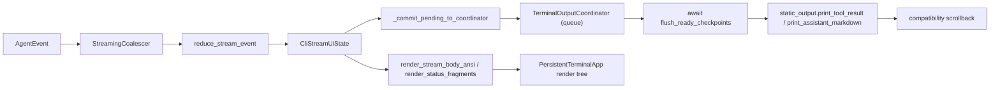
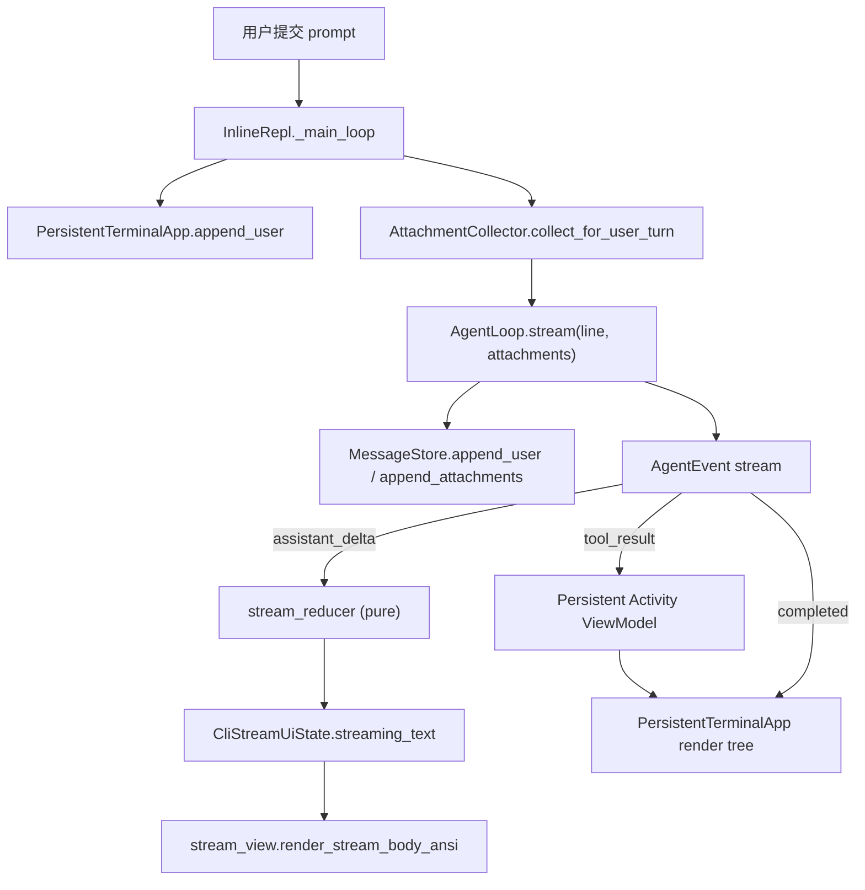

# CLI Message Rendering Architecture

本文记录当前 CLI 如何把会话消息、模型流式输出、工具调用和恢复历史渲染到终端界面。TTY 主路径的渲染事实以 `PersistentTerminalApp` 为准；旧 static/coordinator 仅是 batch 与兼容路径。

## 边界定位

CLI 主界面不是以 `messages.map(renderMessage)` 的方式每轮重绘整个 message 数组。正常对话时，`MessageStore` 是模型上下文和 transcript 的事实来源；终端输出由 `AgentLoop.stream()` 产出的事件驱动。

TTY 路径入口是 `ui/cli/app.py::main()` 创建 `CliRuntime` 后运行 `ui/cli/terminal/repl.py::InlineRepl`。非 TTY 路径仍由 `ui/cli/batch.py` 消费同一事件流并打印到 stdout。

## 输出区域

当前 TTY UI 的主路径只有一个持久区域：

- 持久 render tree：`ui/cli/terminal/persistent_app.py::PersistentTerminalApp` 使用一个长期存在的全屏 `prompt_toolkit.Application`，进入 alternate screen 后统一绘制固定 Header、可滚动 transcript、独立 `You` 用户消息块、Activity、工具二级明细、assistant 流式文本、HITL Interaction Pane、输入分隔线和输入 Buffer。Agent event 只更新 ViewModel，不写 stdout；Activity 因而一直可点击，退出应用后原 terminal/PowerShell 屏幕恢复。
- 兼容输出：`static_output.py` / `output_coordinator.py` 仅供 batch、旧 StreamingSession 测试和少数兼容命令路径，不参与 persistent TTY turn。
- 备用屏幕：`ui/cli/terminal/page.py`、`selector.py` 和 `connect_flow.py` 用临时全屏界面处理 page、选择器和 connect；退出后不把临时正文写入主 scrollback。运行时 Permission / AskUser / PlanReview 使用同一棵 render tree 中、固定在输入框上方的可擦除 Interaction Pane，不进入备用屏幕。

## 流式 UI 协调（execplan §M3 之后）

兼容 `StreamingSession` 内部仍按四个职责拆分；persistent TTY 的主渲染边界是 `PersistentTerminalApp.consume_events()`：

- **State 模型**：`ui/cli/terminal/stream_state.py::CliStreamUiState` 持有 `streaming_text`、`current_assistant_call_id`、`current_model_turn_index`、`tools`、`pending_static_commits`（**统一**的 checkpoint 队列）、`stream_mode`、`error_text`、`assistant_completed`、`assistant_committed`、`turn_completed` 等字段；它是 turn 内 UI 状态的事实来源，**不是**模型上下文或 transcript 的事实来源。
- **Reducer**：`ui/cli/terminal/stream_reducer.py::reduce_stream_event` 是唯一的事件→state 转换入口，是纯函数，不写 stdout、不创建 Rich `Console`、不退出 prompt_toolkit app。
- **View**：`ui/cli/terminal/stream_view.py::render_stream_body_ansi` 和 `render_status_fragments` 把 state 翻译成 prompt_toolkit `ANSI` / `FormattedText`，不修改 state、不写 stdout。View 把 assistant 文本尾部和 tool panel 用一个空行隔开以避免视觉融合。
- **输出协调器**：旧 `TerminalOutputCoordinator` 仍是兼容 StreamingSession 的输出边界；persistent TTY 不调用 `print_tool_result` / `print_assistant_markdown`，而是把状态留在同一个 render tree。

## Checkpoint 提交（execplan §M1/§M2 之后）

兼容 StreamingSession 的 "commit to scrollback" 边界由 **checkpoint** 决定；persistent TTY 不把 Activity 或 assistant 中间内容提交 stdout，而是在 ViewModel 中持续绘制。`StaticCommit` 仍表达两类兼容 checkpoint：

- `assistant_markdown`：在 `assistant_message_completed` 事件到达时由 reducer 立即 stage，payload 是 `streaming_text`，提交后 reducer 立即清空 `streaming_text`，让下一轮 assistant 文本从空动态区开始。
- `tool_result`：在 `tool_result` 事件到达时由 reducer stage，payload 是 `ToolExecutionResult`。**提交顺序以模型声明工具的顺序为准**，而不是以工具完成时间为准 —— reducer 在 `release_ready_tool_result_commits` 中只释放"同一 `assistant_call_id` 下从最小未提交 index 开始连续完成"的结果，防止"后声明但先完成"的工具越过前面的工具。

每个 commit 都携带稳定的 `assistant_call_id` 和 `model_turn_index`：

- `assistant_call_id` 是当前 runtime session 内稳定唯一的字符串，由 `core/stream_events.py::mint_assistant_call_id` 派生。它是 `core/loop.py` 每次进入模型调用时分配的，作为 assistant 文本、tool_call_ready、tool_started、tool_progress、tool_result 的 UI 归属回链。
- `model_turn_index` 是 session 内严格递增的整数。同一 `turn_count` 内可能有多次模型调用（因为工具调用而触发），每次新模型调用都使用新 index。

这两个字段由 `core/loop.py` 注入到所有归属于某次模型调用的事件 metadata 中；reducer 用 `_require_attribution` 强制消费它们，缺失即进入 error 状态而不是静默回退到上一条事件。

兼容事件流图（persistent TTY 主路径绕过 coordinator）：

状态行从 `stream_mode` 和 active tool 集合推导，**绝不会在仍有运行工具时显示裸 `thinking…`**；运行工具时显示 `tool: <name>`，多个工具时显示 `tools: N running`。

## 正常对话渲染流

普通用户输入的显示路径如下：

`InlineRepl._run_turn()` 将 agent event async iterator 交给 `PersistentTerminalApp.consume_events()`。事件经 reducer 折叠进 `CliStreamUiState`；`assistant_delta` 累加到 `state.streaming_text`，由同一个 render tree 重绘。`completed` 后 Activity 与 assistant 文本进入 persistent transcript，屏幕不需要第二次 stdout repaint。

因此，正常对话中屏幕上的流式 assistant 文本来自 runtime event；定稿文本来自同一个 state buffer，而不是从已经持久化的 assistant message 重新读取。

## 工具调用渲染流

工具事件仍来自 `core/stream_events.py` 的 `AgentEvent`，当前 TTY 主屏会显示工具生命周期，而不是只显示最终结果：

- `tool_call_ready`：reducer 把工具加入 `state.tools`，状态 `queued`；动态区 view 显示 `tool: <name> (queued)`。
- `tool_started` / `tool_progress`：reducer 把工具状态切到 `running` 并更新 `progress`；view 在 body 显示 `tool: <name> <progress>`，状态行显示 `tool: <name>`（多个工具时显示 `tools: N running`）。
- `tool_result`：reducer 把工具从 `state.tools` 移除并更新对应 `ActivityToolCall` 的完成/错误状态。Persistent TTY 只重绘 Activity 行；结果正文仍由 transcript/trace 事实来源保存。兼容 StreamingSession 才会将旧 checkpoint 交给 coordinator。

工具结果摘要只消费 `ToolExecutionResult` 的公共字段和 metadata，不读取文件、不执行工具，也不导入 `tools/*` handler。未覆盖的工具继续走 fallback 摘要，服务 MCP、插件或未来新工具。

工具执行完成后，loop 会把结果追加回 `MessageStore`，作为内部 `role="tool_result"` message；如果工具结果带有 followup attachment，loop 还会追加 attachment message。UI 的静态摘要只是展示，不是上下文事实来源。

## 两级活动视图

TTY 持久 render tree 把工具生命周期归约为 `ActivityGroup`。reducer 仍可使用
`ModelStreamEvent.metadata` 的 `activity_id` / `activity_title` 生成语义标题；没有显式
字段时使用 provider-agnostic 的工具类别回退（分析/修改/测试/命令），未知工具才显示
`Working…`。Persistent UI **保留 assistant/model invocation 边界**：即使连续两轮的
`activity_title` 相同，也分别渲染为两个 Activity，而不会跨 model → tool → model 循环
合并成一个巨型工具组。这样 assistant progress text 与对应工具可以按
`model_turn_index` 交错显示：`文字 → Activity → 下一段文字 → 下一 Activity`。

Activity 行使用 `▶` / `▼`、真实 prompt_toolkit mouse handler 和
`Application(mouse_support=True)`；点击只改变该 `ActivityGroup.expanded`，
Ctrl+O 切换全部可见组。展开只显示第二级工具名和一个关键参数，例如
`Read core/loop.py`、`Search "PermissionMode"` 或 `Bash "pytest -q"`，不显示
正文、stdout、stderr、diff 或 raw JSON。Activity 保留在 transcript ViewModel
中，所以回合完成后仍可点击，不受 scrollback 不可交互限制。

## HITL Interaction Pane

Permission、AskUser 和 PlanReview 都不作为 transcript 内容渲染。`TerminalInteractionHost` 持有其临时状态，`PersistentTerminalApp` 在 transcript 与底部输入框之间绘制独立 Interaction Pane。

TTY 路径使用 `ui/cli/terminal/permission_prompt.py::TtyPermissionPrompter`。它把三选项状态交给已绑定的 `TerminalInteractionHost`，由
`PersistentTerminalApp` 在同一 render tree 内绘制；不会通过 `run_in_terminal` 嵌套或写 stdout。非 TTY 路径继续使用 `ui/cli/permissions.py::CliPermissionPrompter` 的 stdin/stdout fallback。

选择型 Permission / AskUser 由 host 的 eager key bindings 消费；AskUser 允许 `options=[]`/省略 options 表示自由文本题，PlanReview 的 `Request changes` 也进入自由文本阶段。这两种文本输入都复用持久 Buffer 的 Enter，不创建嵌套 `PromptSession`。PlanReview 的 Approve / Request changes / Reject 三选项同样留在 Interaction Pane；仅无 persistent app 的兼容分支保留旧 selector。权限策略和 guard 判断仍属于 services 层。

## 恢复历史渲染

`/resume` 成功后会真正恢复到可继续交互的主 REPL，并把恢复后的历史消息按正常会话规则重放进 persistent transcript，而不是打开临时历史 page。两条入口语义一致：

- 带 target 的 `/resume <id>` 由 `dispatch_command()` 直接恢复 runtime，返回 `presentation="inline"`、`renderer.render_resume()` 一行恢复通知，以及 `replay_messages`（恢复后的当前消息链）。
- 无参数 `/resume` 由 `InlineRepl._run_resume_selector()` 打开 `TransientSelector`。按 Enter 选中后立即调用 `restore_runtime_from_target()`，返回与带 target 路径完全相同形态的 `CommandResult`，不做二次确认，不展示历史 page。

`InlineRepl._handle_command()` 在恢复 runtime、更新 persistent app 的 runtime/completer 后，等 selector（若有）退出备用屏幕，把 `replay_messages` 转为 app transcript 条目；非 TTY/兼容调用仍使用 `transcript_replay.py` 的静态输出函数。

重放不引入恢复专用摘要格式：persistent app 的 user/assistant/tool-result 条目保持原顺序，工具正文只做有界摘要；兼容路径仍复用 `print_user_submitted()`、`print_assistant_markdown()` 和 `print_tool_result()`。只有 tool call 没有正文的 assistant 消息不打印，attachment 当前没有稳定主屏渲染因此也不重放。

## 兼容历史视图

`renderer.render_history()` 仍存在，用表格显示 `role/detail`。它主要服务测试和诊断视图，不是普通主屏或 `/resume` 的主要路径。

## 设计约束

- CLI 主界面消费 `AgentEvent` 和 renderer helper，不依赖 provider wire format。
- UI 不能解析完整工具 stdout/stderr 来判断成功或失败；工具结果状态来自 `ToolExecutionResult.is_error`。
- 工具开始、进度和结果展示应继续消费现有 `tool_call_ready`、`tool_started`、`tool_progress`、`tool_result` 事件，不从 message 数组反推正在执行的工具。
- 权限面板由 permission prompter 负责，不能被 `/permissions` 只读视图或普通 tool result 摘要替代。
- 静态区展示不是上下文事实来源；`MessageStore`、transcript 和 tool result store 才是模型上下文与恢复依据。
- **persistent TTY 里任何模块都不得绕过 `PersistentTerminalApp` 写 stdout**。reducer、view、HITL host 全部只更新 ViewModel/Interaction Pane state。
- 动态区只渲染 `CliStreamUiState`；不允许 reducer 写入 stdout，不允许 view 修改 state。旧 coordinator 约束仅适用于兼容 StreamingSession。

## 运行中输入与命令排队

执行计划 `docs/exec-plans/active/cli-running-input-queue.md` 重新设计了用户输入在 agent turn 期间的提交路径：

- **空闲/运行中输入归 `PersistentTerminalApp`**：同一长期 Application 的底部 Buffer 使用 `InlineCompleter`；HITL 自由文本阶段优先把 Enter 路由给 `TerminalInteractionHost`，否则空闲 Enter 创建 submit task、运行中 Enter push 到共享 `InputQueue`。
- **`InputQueue` 存 `QueuedInput`**：text、kind (`prompt` / `slash`)、单调 sequence、可见性。空白不入队；`snapshot()` 是只读快照。
- **drain 归 `InlineRepl._drain_queue`**：当前 turn 结束后按 FIFO 弹出；`kind == "slash"` 走 `_handle_command`（不进 agent），`kind == "prompt"` 走 `_run_turn`。Slash 命令若替换 runtime（`/clear` / `/resume` / `/connect`），drain 继续并复用新的 prompt session。
- **queued preview 归 PersistentTerminalApp**：同一 render tree 显示最多 N 条可见 queued input + overflow 摘要；预览只在 ViewModel，不写 stdout。
- **persistent TTY 不写静态区**：`_handle_command` 的 inline renderable、用户行、Activity 与 assistant 文本都进入 app transcript；batch/兼容路径仍沿用既有 static/coordinator 边界。
