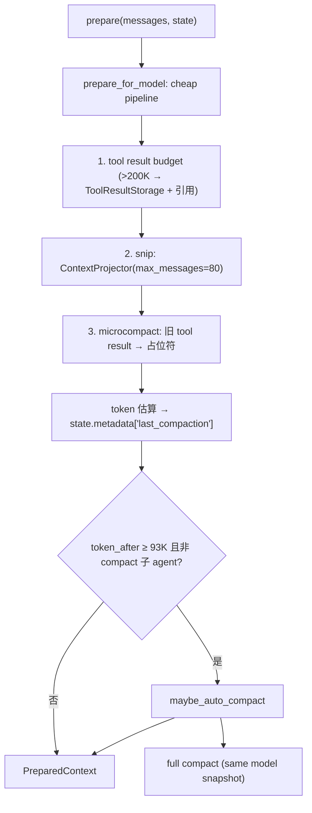

# Compaction Architecture

本文描述 `services/compaction/` 的架构边界：tool result 预算、micro/auto/manual/reactive 压缩和 Full Compact。它作为 `ContextEngine` preparer 链的最内层接入，不进入 `core/loop.py` 的具体分支。底层消息存储见 `context-architecture.md`，长期记忆选择见 `memory-architecture.md`，共享工具结果存储见 `utils/toolResultStorage`。

## 文件职责

| 文件 | 职责 |
|:---|:---|
| `service.py` | `ContextCompactionService`：cheap pipeline + auto/manual/reactive compact |
| `token_estimator.py` | 保守本地 token 估算（文本 ≈ ceil(len/3)） |
| `types.py` | `CompactionConfig`、`CompactionTrigger`、`CompactionResult` |

## 接口设计

### ContextCompactionService

```python
async def prepare(messages, state) -> PreparedContext          # preparer 入口
async def prepare_for_model(messages, state) -> CompactionResult # cheap pipeline，不改写 store
async def maybe_auto_compact(messages, state) -> CompactionResult | None
async def manual_compact(state, *, focus=None) -> CompactionResult
async def reactive_compact(state, *, error: ProviderError) -> CompactionResult
def bind_runtime(*, message_store=None, result_store=None, model_client=None, current_model_context=None) -> None
```

它实现 `core` 期望的 `ReactiveCompactor` 协议。

### CompactionConfig（关键默认值）

| 字段 | 默认 |
|:---|:---|
| `context_window_tokens` | 128_000 |
| `compact_trigger_ratio` / `compact_summary_reserve_ratio` / `compact_safety_buffer_ratio` | 0.80 / 0.10 / 0.05 |
| `compact_recent_tail_ratio` | 0.08 |
| `recent_tail_min_tokens` / `recent_tail_max_tokens` | 4_000 / 32_000 |
| `tool_result_budget_chars` | 200_000 |
| `tool_result_preview_chars` | 4_000 |
| `microcompact_keep_recent` | 5 |
| `snip_max_messages` | 80 |
| `max_consecutive_auto_compact_failures` | 3 |
| `max_reactive_compact_retries` | 1 |

派生：`compact_trigger_tokens = 102_400`，`compact_summary_reserve_tokens = 12_800`，`compact_safety_buffer_tokens = 6_400`，`recent_tail_budget_tokens = 10_240`，`auto_compact_threshold_tokens` 兼容别名指向 `compact_trigger_tokens`。

### CompactionTrigger / CompactionResult

`CompactionTrigger`：`MICRO`、`AUTO_FULL`、`MANUAL`、`REACTIVE`。`CompactionResult`：`trigger`、`messages`、`token_before`、`token_after`、`transcript_refs`、`metadata`。

## 核心数据流



## 关键机制

### Cheap pipeline（投影，不改写 store）

`prepare_for_model` 顺序：tool result 预算（超 200K 字符的结果写共享 `ToolResultStorage`，模型只见引用+preview）→ snip（`ContextProjector` 滑窗，最多 80 条）→ microcompact（旧的非 stored tool result content 替换为占位符）→ token 估算。这一阶段只投影，不调用 `replace_messages_for_compaction`。

### Destructive compact（改写活动链）

`maybe_auto_compact` / `manual_compact` / `reactive_compact` 才调用 `replace_messages_for_compaction`。full compact 产物为 `(boundary_user_msg, summary_user_msg, *tail)`：boundary metadata 含 `is_compact_boundary`、`compact_trigger`、`compact_source`；summary metadata 含 `is_compact_summary`。摘要由 fork subagent 生成。`compact_request` 只表示一次请求已发起；真实 provider usage 与 duration 以 `compact_completed` 为准，`compact_failed` 单独记录失败，避免把请求前估算误当成实际 usage。

### 触发与断路器

`prepare()` 先跑 cheap pipeline，若 `token_after ≥ auto_compact_threshold`（默认 102,400）且当前不是 compact 子 agent 调用，则尝试 `maybe_auto_compact`。连续 auto compact 失败 ≥ 3 次（`max_consecutive_auto_compact_failures`）后跳过自动压缩。reactive compact 由 loop 在 `context_limit_exceeded` 时触发（最多 `max_reactive_compact_retries` 次）。

### Full Compact 与稳定前缀

`ContextCompactionService` 只负责 cheap pipeline 和 Full Compact；长期记忆 selector/extraction 属于 `services/memory/`，不再由 compaction service 持有 session-memory store。Full Compact 首选 `CurrentModelContext.snapshot_copy()` 得到最近一次实际发送给 provider 的 immutable snapshot；没有可复用 snapshot 时才安全回退到当前消息的最小投影。compact instruction 只追加在父 snapshot 消息末尾，保留 system prompt、tool schema 和消息顺序以争取 prompt-cache 命中。

`compact_request` 是请求前的形状/预算事实，不能当作 provider usage；`compact_completed` 才记录实际 input/cache-read/uncached/output/reasoning/duration，`compact_failed` 单独记录失败。

Full Compact 的 prompt-cache 验收还要求保留父模型请求的 immutable snapshot：system prompt、tool schema 与 parent message 前缀保持一致，compact instruction 只追加在末尾。一次真实 `mimo-v2.5-pro-1m` 验证记录 input `14396`、cache-read `14336`、uncached `60`、output `404`、duration `13688.006 ms`；详见 `docs/evidence/v1-evidence.md`。该数值是单次 live evidence，不是平均性能承诺。

### ToolResultStorage

路径 `<session_dir>/tool-results/<result_id>.txt`，`persist_tool_result(...) -> StoredToolResultRef`，`format_model_reference(ref, preview)` 生成模型可见引用。该实现位于 `utils/toolResultStorage`，同时服务 transcript 外置、compaction 层 200K 字符预算和 executor `ToolResultPolicy` 预算；compaction 只消费 ref 和模型引用文本，不拥有通用存储实现。

### PreCompact hook

`PRE_COMPACT` hook 返回的 `metadata["summary_instructions"]` 可注入 compact prompt；`POST_COMPACT` / `COMPACT_FAILED` 为观察事件。详见 `hook-architecture.md`。

## 持久化路径

- shared tool result storage：`.nervure/sessions/<session_id>/tool-results/<result_id>.txt`（旧 `.onecode/sessions/` 结果可读取）
