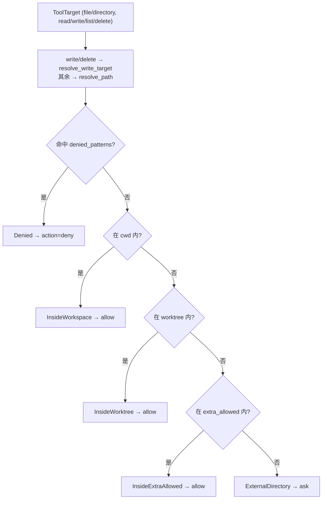

# Guard Architecture

本文描述 `services/guard/` 的架构边界：项目访问边界和路径安全策略。guard 做**确定性**的路径分类与 allow/ask/deny 决策；deny-first 的多源合并由 `permission-architecture.md` 负责，生命周期扩展由 `hook-architecture.md` 负责。底层跨平台路径处理位于 `infrastructure/filesystem/paths.py`（见 `model-provider-architecture.md`）。

## 文件职责

| 文件 | 职责 |
|:---|:---|
| `boundary.py` | `SandboxBoundary`、路径分类核心 `classify_path`、deny pattern 匹配 |
| `policy.py` | `SandboxGuard` 入口，将 `SandboxDecision` 映射为 `GuardAction`，生成 `GuardPolicy` |
| `resolver.py` | 路径解析 facade，re-export `infrastructure.filesystem.paths` 的函数 |

## 接口设计

### SandboxBoundary

```python
SandboxBoundary(cwd, worktree=None, extra_allowed_dirs=(), denied_patterns=())
```

- `cwd`：主工作区根（CLI 中为 workspace）。
- `worktree`：可选 git worktree 根；若解析为文件系统根则置 `None`，防止整盘放行。
- `extra_allowed_dirs`：额外允许目录。
- `denied_patterns`：显式拒绝模式，优先于一切 allow 判断。

### SandboxDecision（路径分类结果）

| 类型 | `kind` | 字段 |
|:---|:---|:---|
| `InsideWorkspace` | `inside_workspace` | `path` |
| `InsideWorktree` | `inside_worktree` | `path` |
| `InsideExtraAllowed` | `inside_extra_allowed` | `path`、`root` |
| `ExternalDirectory` | `external_directory` | `path`、`parent_dir`、`pattern` |
| `Denied` | `denied` | `path`、`reason`、`pattern` |

### SandboxGuard / GuardPolicy

```python
def check_path(...) -> GuardPolicy
def check_write_target(...) -> GuardPolicy
```

`GuardAction`：`allow`/`ask`/`deny`。`GuardPolicy` 字段：`action`、`decision`、`operation`、`target_kind`、`original_path`、`normalized_path`、`reason`、`pattern`；`to_tool_error()` 生成结构化错误 payload。

## 核心数据流



## 关键机制

### 分类顺序

`classify_path`：write/delete 用 `resolve_write_target`（允许最终路径不存在），其余用 `resolve_path`（存在则 strict realpath）→ 检查 deny pattern → cwd → worktree → extra_allowed → 否则 external。`SandboxGuard.check_path` 把 `denied` 映射为 deny、`external_directory` 映射为 ask、其余 inside 映射为 allow。

### Deny pattern 匹配

`_match_denied`：以 `*` 结尾用目录包含语义（`contains_path`，避免 `/repo-a` 误匹配 `/repo`）；否则精确路径匹配（`resolve_path` 相等，或 `FileNotFoundError` 时字符串相等）。相对 pattern 基于 cwd 绝对化。

### 跨平台与符号链接

路径处理基于规范化路径而非字符串前缀：解析为绝对路径，归一 Windows 等价形式（`/C:`、`/mnt/c`、`/cygdrive/c`），对已存在路径用 realpath 消除符号链接歧义，对不存在的写入目标解析到稳定绝对路径再判断父目录与最终目标是否越界，包含判断使用 `relative_to` 语义。

### 边界语义

- `inside_workspace` / `inside_worktree` / `inside_extra_allowed`：allow，进入权限流程。
- `external_directory`：ask，需要明确决策。
- `denied`：直接 deny，不进入动态组装或人工确认。

## 与权限/工具的关系

executor 对 `kind in {file, directory}` 且 operation 为 `read`/`write`/`list`/`delete` 的 target 调用 guard。`command/execute` 与 `external_service/call` 由 permission policy 判断是否 ask。guard 是安全边界，hook 是扩展点；冲突时 guard 优先，deny 结果不能被 hook、session allow、permission prompter 或模型请求覆盖。

生产环境中 CLI 仅设 `cwd=workspace`，未配置 worktree/extra_allowed/denied_patterns；这些是 guard 已支持但当前未在 CLI 启用的能力。
