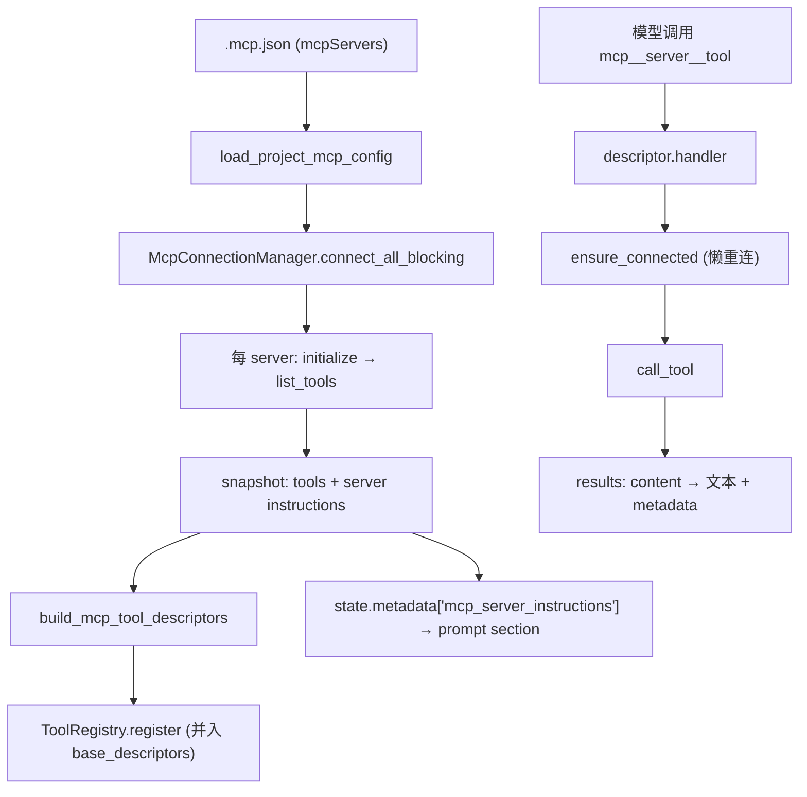

# MCP Architecture

本文描述 `services/mcp/` 的架构：连接 MCP（Model Context Protocol）server、发现其工具，并把发现的工具动态包装成普通 `ToolDescriptor` 接入工具运行时。MCP 工具不在 `tools/` 目录，而是运行时生成。

## 文件职责

| 文件 | 职责 |
|:---|:---|
| `types.py` | MCP 配置、连接快照、发现工具、调用结果等 dataclass |
| `config.py` | 从 `{workspace}/.mcp.json` 加载 `McpConfigSet` |
| `manager.py` | `McpConnectionManager`：连接生命周期、工具发现、调用、重连 |
| `trust.py` | 项目 MCP stdio server 的本地 trust fingerprint、trust store 和最小化子进程环境 |
| `names.py` | server/tool 名规范化与 provider 可见名 `mcp__{server}__{tool}` |
| `tool_factory.py` | 将 `McpDiscoveredTool` 包装为 `ToolDescriptor` |
| `results.py` | MCP SDK 结果 → 模型可见文本 + metadata |

## 接口设计

### McpConnectionManager

```python
async def connect_all() / def connect_all_blocking() -> None
def snapshot() -> ...                      # 当前连接与发现工具
async def ensure_connected(server) -> None
async def call_tool(server, tool, arguments) -> ...
async def close_all() -> None
```

`.mcp.json` 根键仅允许 `mcpServers`，支持 transport：`stdio`/`sse`/`http`。

### build_mcp_tool_descriptors

`tool_factory.build_mcp_tool_descriptors(manager)` 遍历 `snapshot().tools`，每个生成 `ToolDescriptor`：`name = mcp__{server}__{tool}`，handler 闭包调用 `manager.call_tool(...)`，`classify_input` 依据 MCP annotations，`permission_subject = "{server_name}/{tool_name}"`。

## 核心数据流



## 关键机制

### 连接

`connect_all()` 先 `close_all()` 再并行连接 enabled servers，并发限制 stdio 3 / remote 20；每 server `initialize()` → `list_tools()` 构建发现工具列表；stdio 捕获 stderr（上限 1MB）；server instructions 截断至 2048 字符存入 snapshot。CLI 在 `build_runtime` 中同步 `connect_all_blocking()`，配置错误记 `source="mcp_config"` 并阻止启动。`call_tool` 时 `ensure_connected`，失败则 disconnect + 重连重试。

stdio server 在执行前必须通过本地 trust policy。fingerprint 覆盖 transport、command、args、cwd 和显式 env；未信任 server 状态为 `untrusted`，不会启动子进程、发现工具或注入 instructions。stdio 子进程环境只包含基础 allowlist 父环境加 `.mcp.json` 显式 `env`，不继承完整父进程环境。

### 动态 descriptor 与分类

`classify_input` 读 MCP annotations：`readOnlyHint=True` 且 `destructiveHint!=True` → `read_only=True`、`concurrency_safe=True`；target 为 `(external_service, call, server/tool)`。result_policy 默认 50k、超出 persist、preview 4k。非只读的 `external_service/call` 会被 permission policy 纳入 ask（见 `permission-architecture.md`）。

### 结果投影

`results` 拼接 content 块：text 直出，image/resource 输出占位摘要；metadata 含 `mcp_is_error`、`mcp_meta`、`structured_content`；空 content → `(MCP tool returned no content.)`。

### 命名

组件 sanitize（非 `[a-zA-Z0-9_-]` → `_`，空则 `unnamed`），provider 名 `mcp__{normalized_server}__{normalized_tool}`，最大 64 字符，超长用 SHA256 8 位 hash 后缀稳定截断。`permission_subject` 用 `{server}/{tool}`，与 descriptor 名分离。

### Prompt 与可观测性

server instructions 注入 prompt `# MCP Server Instructions` section（见 `prompt-architecture.md`）。manager 发布 `mcp_connect` span 与 `mcp_tool_call` event，MCP 错误经 `ErrorLogRecorder.record_mcp_error` 记录（见 `observability-architecture.md`）。

## 持久化与配置

- 配置：`{workspace}/.mcp.json`
- Trust 记录：`{workspace}/.onecode/settings.json` 的 `mcp.trustedServers`
- 连接状态仅存进程内存，不持久化。
