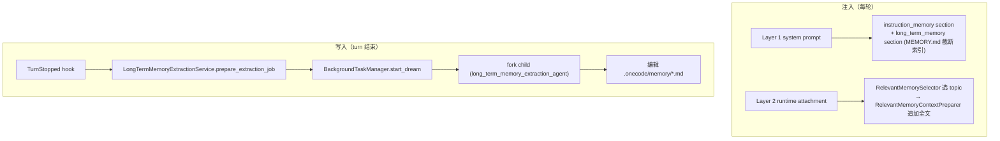

# Memory Architecture

本文描述 `services/memory/` 的架构边界：跨会话的长期记忆（long-term memory）、分层指令记忆（ONECODE.md）、运行时相关记忆注入和后台记忆提取。它区别于 `services/compaction/` 中只服务单会话连续性的 session memory（见 `compaction-architecture.md`）。

## 文件职责

| 文件 | 职责 |
|:---|:---|
| `auto_store.py` | `LongTermMemoryStore`：`.onecode/memory/` 目录读写与索引重建 |
| `paths.py` | 记忆路径解析：`memory_dir`、`MEMORY.md` entrypoint、`is_auto_memory_path` 判定 |
| `types.py` | `MemoryKind`、`LongTermMemoryFile`、指令记忆相关类型 |
| `frontmatter.py` | 简易 YAML frontmatter 解析 |
| `instruction_loader.py` | `InstructionMemoryLoader`：分层加载 `ONECODE.md`、rules、local overrides |
| `prompt.py` | `LongTermMemoryPromptProvider`：system prompt 中的记忆索引与使用说明 |
| `selector.py` | `RelevantMemorySelector`：LLM side-query 选相关 topic 文件 |
| `context_preparer.py` | `RelevantMemoryContextPreparer`：追加 synthetic memory attachment |
| `extraction.py` | `LongTermMemoryExtractionService`：fork child 后台提取记忆 |

## 接口设计

### LongTermMemoryStore

```python
def ensure_exists() / read_entrypoint() -> str
def truncated_entrypoint(*, max_lines=200, max_chars=25000) -> tuple[str, bool]
def scan() -> tuple[LongTermMemoryFile, ...]
def read_topic(relative_path, *, max_lines=200, max_chars=4096) -> str
def rebuild_entrypoint() / record_memory_write(state, path) -> None
```

存储结构：`<workspace>/.onecode/memory/`，含索引 `MEMORY.md` 和各 `<topic>.md`（frontmatter：`name`、`description`、`type`）。`MemoryKind`：`user`/`feedback`/`project`/`reference`。

### RelevantMemorySelector / RelevantMemoryContextPreparer

```python
async def select(messages, state, catalog) -> tuple[LongTermMemoryFile, ...]   # 最多 5 个
async def prepare(messages, state) -> PreparedContext   # 先 await inner，再追加 attachment
```

selector 用 `ModelClient` side-query 返回 JSON `{"selected_memories": [...]}`。preparer 生成的 attachment：`{role: "attachment", attachment: {type: "relevant_memories", path, content}, metadata: {synthetic: True, source: "long_term_memory"}}`，受 `max_total_chars=60000` 预算约束。

### InstructionMemoryLoader

`load()` 返回 `InstructionMemoryResult(files, rendered_text, fingerprint, warnings)`。加载顺序：user 层（`~/.onecode/ONECODE.md` + `~/.onecode/rules/*.md`）→ project 层（workspace 到 cwd 链上的 `ONECODE.md`、`.onecode/ONECODE.md`、`.onecode/rules/*.md`）→ local 层（`ONECODE.local.md`）。支持 `@./` include（最大深度 5），frontmatter `paths` glob 过滤。

### LongTermMemoryExtractionService

```python
def prepare_extraction_job(messages, state, *, tool_calls) -> LongTermMemoryExtractionJob | None
async def run_extraction_job(job, state) -> None
```

`LongTermMemoryExtractionPolicy`：`enabled=True`、`max_turns=5`。

## 核心数据流

长期记忆有三条通道：



## 关键机制

### 双通道注入

- **Layer 1（system prompt）**：`InstructionMemoryLoader` 渲染 ONECODE.md 规则，`LongTermMemoryPromptProvider` 提供记忆目录、类型规则和 `MEMORY.md` 截断索引；两者通过 `prompt-architecture.md` 中的 section 注入，各自带 fingerprint 支持缓存。
- **Layer 2（runtime attachment）**：每轮 `RelevantMemoryContextPreparer.prepare()` 先 await 内层 preparer（compaction），再用 selector 选中的 topic 全文追加为 synthetic attachment。该 attachment 只在 `prepare()` 时临时加入 `PreparedContext`，**不写回 `MessageStore` 或 transcript**。

### Dream 后台提取

写入通过 `TurnStopped` hook（CLI 注册）启动 `dream` 后台任务，由 fork child 在后台更新 `.onecode/memory/`，不阻塞 turn 结束、不产生用户可见通知（见 `background-task-architecture.md`）。child 被标记 `long_term_memory_extraction_agent`，权限层只允许 `read_file`/`grep`/`glob` 读 + `write_file`/`edit_file` 写 `.onecode/memory/` 下的 `.md` 文件（见 `permission-architecture.md`）。

### 提取决策

`should_extract_long_term_memory` 跳过：`disabled`、`tool_use_continuation`、`compact`、`fork_child`、`extraction_child`、`main_agent_memory_write`、`cursor_current`；其余触发 `extract`。

## 持久化路径

- 长期记忆：`<workspace>/.onecode/memory/MEMORY.md` + topic files
- 指令记忆：`ONECODE.md`、`.onecode/ONECODE.md`、`.onecode/rules/*.md`、`ONECODE.local.md`（user/project/local 分层）
