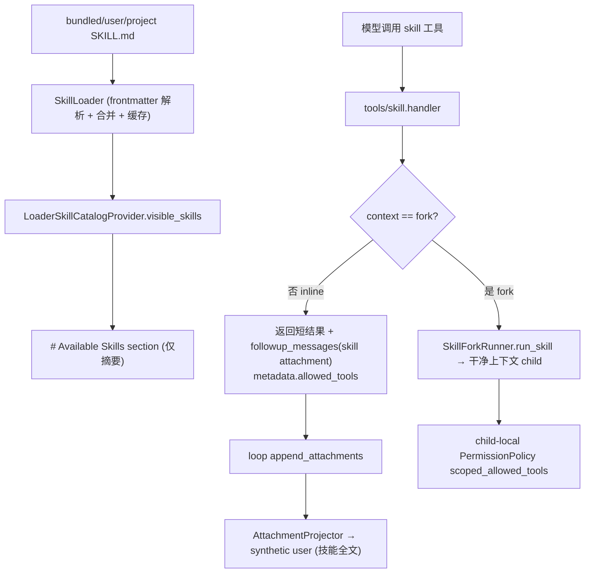

# Skill Architecture

本文描述 `services/skills/` 与 `tools/skill/` 的架构。skill 是按需加载的能力包，通过 prompt catalog 暴露摘要、`skill` 工具按需加载全文，加载后可临时授权工具。

## 文件职责

| 文件 | 职责 |
|:---|:---|
| `types.py` | `SkillCommand`、`SkillSource`、`SkillContext` |
| `frontmatter.py` | 轻量 YAML-like frontmatter 解析 → `SkillCommand` |
| `loader.py` | 文件系统发现、三层来源合并、按 cwd 缓存、`init_bundled_skills()` |
| `catalog.py` | `LoaderSkillCatalogProvider`：prompt 可见技能过滤 |

`tools/skill/tool.py` 把加载逻辑包装成 `skill` 工具 descriptor（见 `builtin-tools-architecture.md`）。

## 接口设计

### SkillCommand

`name`、`description`、`content`（SKILL.md 正文）、`source`（`bundled`/`user`/`project`）、`root`、`when_to_use`、`allowed_tools=()`、`context`（`inline`/`fork`，默认 inline）、`model`、`user_invocable=True`、`disable_model_invocation=False`、`paths=()`、`frontmatter_keys`。

### SKILL.md frontmatter

| frontmatter 键 | 字段 |
|:---|:---|
| `name` / `description` / `when_to_use` | 同名（缺省用目录名 / 正文首段） |
| `allowed-tools` | `allowed_tools`（逗号分隔或 YAML 列表） |
| `context` | `context`（仅 `fork` 触发 fork） |
| `model` | `model` |
| `user-invocable` | `user_invocable`（默认 true） |
| `disable-model-invocation` | `disable_model_invocation`（默认 false） |
| `paths` | `paths`（预留条件激活） |

### 发现来源与 catalog

`SkillLoader` 发现顺序：`bundled` → `user`（`$ONECODE_HOME/skills` 或 `~/.onecode/skills`）→ `project`（`{cwd}/.onecode/skills/<name>/SKILL.md`），后者覆盖同名，按 cwd 缓存。`LoaderSkillCatalogProvider.visible_skills()` 过滤 `user_invocable=True`、`disable_model_invocation=False`、不在 `state.metadata["denied_skills"]`/`disabled_skills` 的技能，注入 prompt `# Available Skills` section（只列 name/description/when_to_use，≤8000 字符，见 `prompt-architecture.md`）。

## 核心数据流

## 关键机制

### inline 加载

`context != "fork"`：工具返回短结果（`Launching skill: <name>`），完整 SKILL.md 作为 `role="attachment"` 的 `followup_messages` 写入；主循环 `append_attachments` 后，`AttachmentProjector` 在下一轮投影为 synthetic user 消息（`[skill loaded: <name>]` + args + source + 正文，见 `attachment-architecture.md`）。

### fork 加载

`context == "fork"`：调用 `SubagentRunner.run_skill()`，动态构造 `AgentDefinition(agent_type="skill:<name>", disallowed_tools=("agent","skill"))`，干净 seed（单条含技能全文 + args 的 user prompt），返回 JSON 格式 child 摘要（见 `subagent-architecture.md`）。

### allowed-tools 授权（deny-first）

inline skill 加载只把 `allowed_tools` 保留在工具结果 metadata 中，不把它写入共享 session grant；后续普通上下文如需执行 ask 工具仍需用户确认。fork skill 在 child runtime 中创建 child-local `PermissionPolicy(scoped_allowed_tools=...)`，只在该 child run 内把本来需要 ask 的工具降为 allow。scoped allow **不能覆盖** read-only subagent、工具 deny/disabled、specific skill deny、guard deny 或项目级 deny（见 `permission-architecture.md`）。用户显式确认产生的 session grant 仍由 `SessionPermissionStore` 管理。

### 双轨过滤

prompt 可见性用 `state.metadata` 的 `denied_skills`/`disabled_skills`；权限层用 `SessionPermissionStore.deny_skill()`。两处需分别配置。
