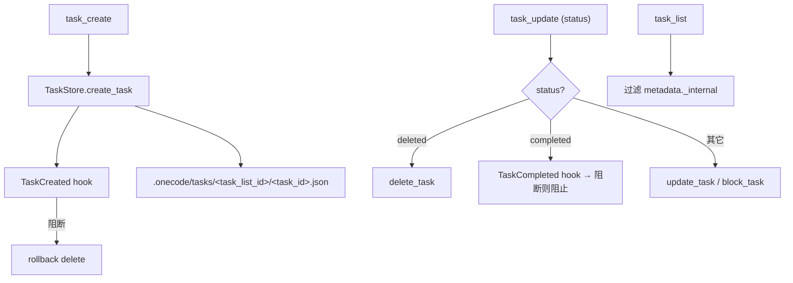

# Task Architecture

本文描述 `services/tasks/` 与 task 工具（`task_create`/`task_get`/`task_list`/`task_update`）的架构。task 是文件持久化、可依赖、可 claim 的工作单元，作用域为 task list，可被父子 agent 共享。

## 文件职责

| 文件 | 职责 |
|:---|:---|
| `types.py` | `TaskRecord`、JSON 序列化/反序列化（camelCase） |
| `store.py` | 文件-backed `TaskStore`：CRUD、依赖图、claim |
| `ids.py` | `resolve_task_list_id()`：task list 作用域解析 |

task 工具见 `builtin-tools-architecture.md`。

## 接口设计

### TaskRecord

| Python 字段 | JSON 键 | 说明 |
|:---|:---|:---|
| `id` | `id` | 数字字符串 ID |
| `subject` | `subject` | 必填 |
| `description` | `description` | 必填 |
| `active_form` | `activeForm` | 可选 |
| `owner` | `owner` | claim 后写入 |
| `status` | `status` | `pending`/`in_progress`/`completed` |
| `blocks` | `blocks` | 本任务阻塞的任务 ID |
| `blocked_by` | `blockedBy` | 阻塞本任务的任务 ID |
| `metadata` | `metadata` | 自由 dict（`_internal=True` 的任务不在 task_list 中展示） |

### TaskStore

`create_task`、`get_task`、`list_tasks`、`update_task`、`delete_task`、`block_task`、`claim_task`。线程安全（`threading.RLock`），原子写入（temp 文件 + `Path.replace()`），ID 由 `.highwatermark` 递增生成。

### resolve_task_list_id

优先级：环境变量 `ONECODE_TASK_LIST_ID` → `state.metadata["task_list_id"]` → `state.metadata["parent_task_list_id"]`（subagent 继承）→ fallback `state.session_id`；sanitize 后写回 `state.metadata["task_list_id"]`。

## 核心数据流

## 关键机制

### 依赖图与 claim

`block_task()` 维护双向 `blocks`/`blocked_by` 边并做环检测；`claim_task()` 检查所有 blocker 是否 completed 才允许认领。

### Hook 集成

`task_create` 创建后触发 `TaskCreated` hook，阻断则回滚删除已创建 task；`task_update` 在状态更新为 `completed` 前触发 `TaskCompleted` hook，阻断则阻止完成（见 `hook-architecture.md`）。

### 父子共享

`agent` 工具通过 child metadata 传递 `task_list_id` + `parent_task_list_id`，使父子 agent 共享同一 task graph（见 `subagent-architecture.md`）。

## 持久化路径

- task 根目录：`{workspace}/.onecode/tasks/`
- 每 task list：`{root}/<task_list_id>/<task_id>.json`，递增水位线 `.highwatermark`

## 当前状态

task system 的进一步演化（跨会话恢复、多 agent 协调边界）见 `docs/exec-plans/active/task-system.md`。
